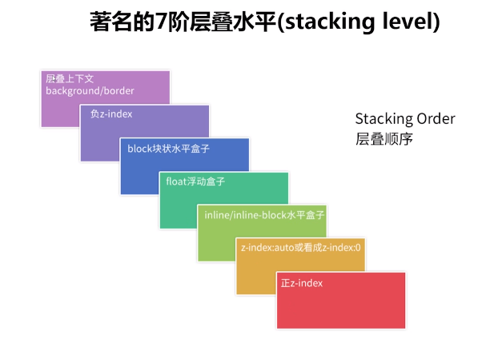

## z-index

首先，并不是所有的元素都有支持z-index
##什么是z-index
z-index制定了元素以及内部子元素的z顺序，可以决定元素发生覆盖的时候，决定那个元素在上面。
通常比较大的z-index的值会覆盖比较低的那一个。 

## 特性
1. 支持负值
2. 支持css3 animation动画
3. css2.1时代，需要和定位元素配合使用

> 如果不考虑css3，那么只有定位元素的z-index才会有作用。

##支持属性值
1. auto     默认值
2. integer 整数值
3. inherit 继承

## css3中的层叠上下文和层叠水平

1. 层叠上下文 stacking context 是html中元素的一种三维概念，表示元素在z轴上有了 “可以高人一等”的属性
	1. 页面根元素天生具有 层叠上下文，称之为 `根层叠上下文`
	2. zindex值为数值的定位元素也具有层叠上下文 例如z-index:10
1. 层叠水平： 层叠上下文中的每一个元素都有一个层叠水平 (stacking level) 决定了同一个层叠上下文中元素在z轴上的显示顺序。
	1. 遵循谁大谁上
	2. 遵循后来居上

> 注意，stacking level 与 z-index不是一个东西（普通元素也有层叠水平，所以看起来相似，但其实没有相同之处）

## 层叠上下文特性
1. 层叠上下文可以嵌套，组成一个分层次的层叠上下文。（父亲可以当官/儿子也可以当官/孙子也可以当官，互相之间没有什么影响。)
2. 每一个层叠上下文都与 兄弟元素独立，当层叠上下文变化的时候，只会影响自己的后代元素（内部元素），与兄弟元素没关系(自己只管好自己家庭，自己的兄弟不关心，是死是活还是富贵或者贫穷都没有半毛钱关系)
3. 每一个层叠上下文都是自成体系，当元素的内容被层叠之后，整个元素被认为是在父层的层叠顺序中，也就是说：(当我的元素层叠上下文之后，自己内部的元素发生了什么排辈摩擦之类的，都是自己内部的处理，不会影响当前元素与当前元素父类的关系。)

## 层叠顺序
层叠顺序：

## 为什么需要层叠顺序？
层叠顺序规范元素重叠时候的呈现规则。

## 为什么层叠顺序是这样子的？
这样子更符合页面加载的功能和视觉呈现。
一般来说：
装饰<布局<内容 内容最重要，所以呈现的层叠水平要高、
目的是为了让前端渲染更加规范

## 层叠顺序的潜规则
1. 定位元素默认z-index:auto 可以认为是z-index:0
2. z-index 不是auto的定位元素会创建层叠上下文
3. z-index层叠顺序的比较止步于父级层叠上下文

##
