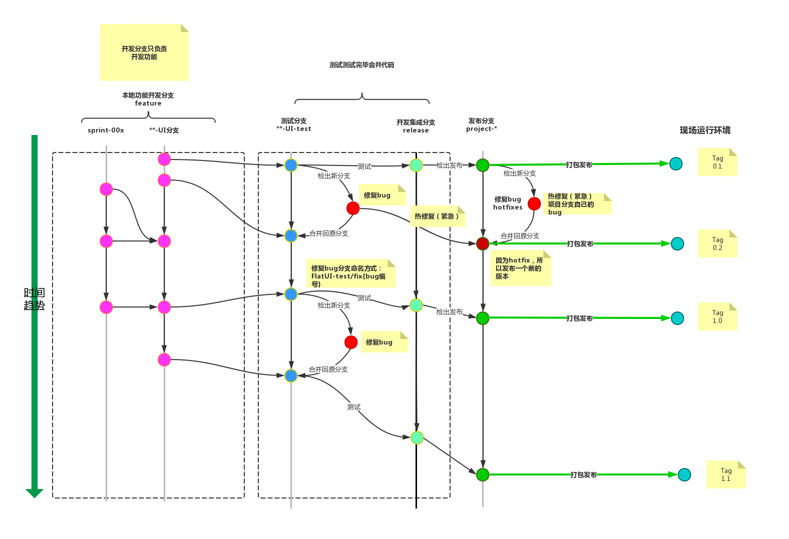
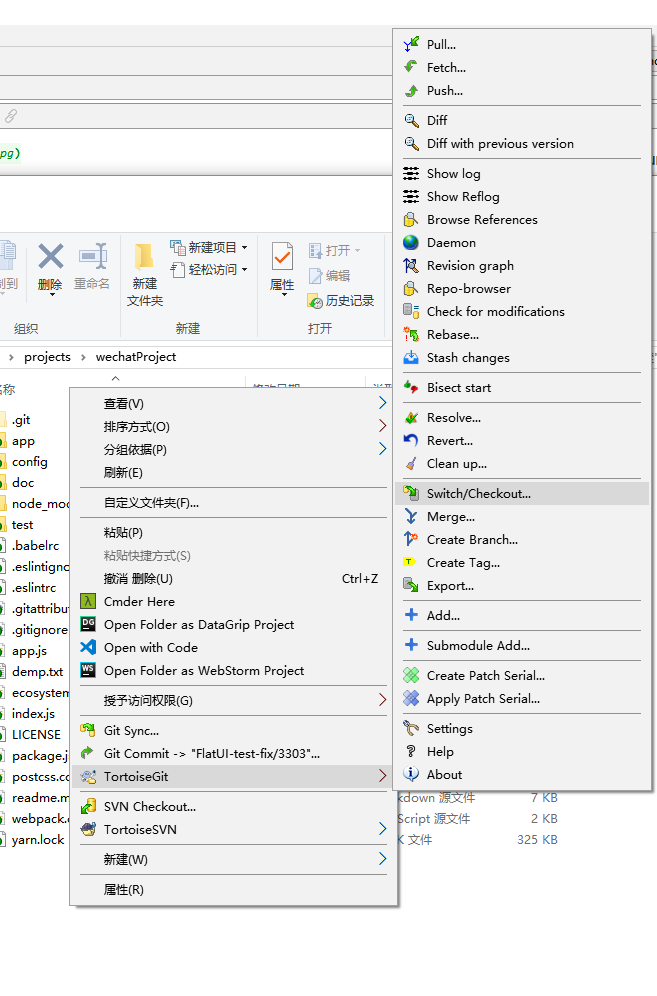
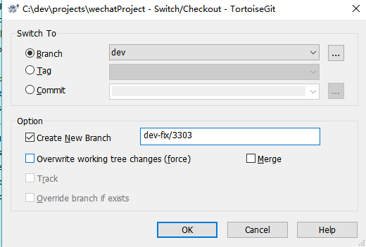
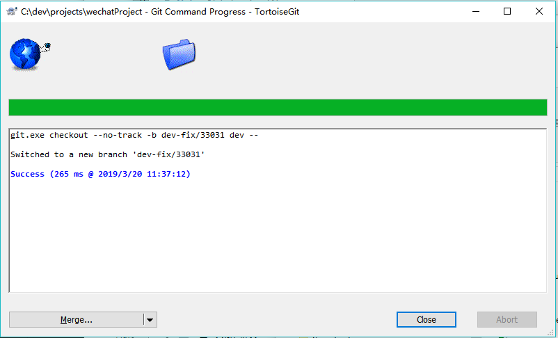
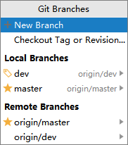
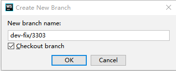
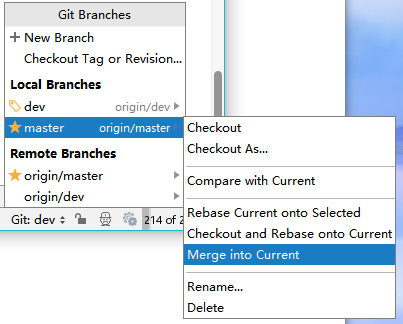
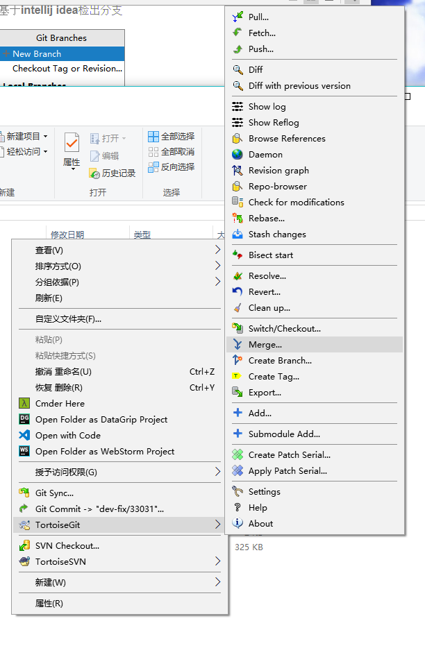
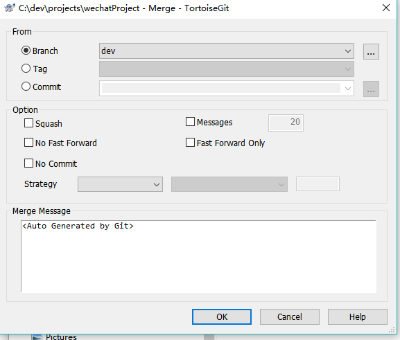

#### ibase2.0 代码版本控制示意图




#### 注意事项：

###### 区分 bug feature
1. bug（缺陷） bug是由测试、开发、用户等人员在 软件运行中因为程序本身有错误而造成的功能不正常、体验不佳、死机、数据丢失、非正常中断等现象。
2. feature（功能点）feature有一个标准的构造与句： xx时间xx人员作了xx操作，系统应该有xx响应。


###### 开发功能点(feature)

1. 基于当前最新的开发分支，检出(checkout)一个分支，
2. 在对应的本地分支提交代码，可能出现多次的commit。
3. 当功能制作完毕，则合并到开发分支并且提交测试(进入测试阶段)。

###### bug修复

!> 理论上来讲，bug是可能会不出现的(如果你的需求足够简单，程序足够强大，代码质量水平足够)

修复bug往往只会存在测试分支出现，测试分支修复bug，
1. 需要在测试分支检出新分支。
2. 测试分支命名为 测试分支-fix/{bug编号}，例如：测试分支为 flatUI-test，出现Bug:3030。则检出新分支：flatUI-test-fix/3030来处理对应的Bug。
3. 修复完毕bug,则作为补丁合并入测试分支

> 有一种情况是，开发者自测出现的bug，可以归纳与自己的feature分支去修复。只有这个是特例


#### 检出分支

```cmd
 git checkout -b {branchName}
```
示例：
```cmd
 git checkout -b  flatUI-test-fix/3030
```
!> 注意 检出分支是不建议使用斜杠 `/` 的，例如当前分支已经有`dev`，此时无法创建分支：`dev/fix`

###### 使用tortoiseGit检出分支





###### 使用git bash检出分支


###### 基于intellij idea检出分支




#### 合并分支

```cmd
 git merge {branchName}
```
将 指定分支：dev分支 合并到当前分支
```cmd
 git merge dev
```

###### 使用intellij合并



###### 使用tortoise git合并
将 dev分支合并到当前分支



#### 删除分支

```cmd
 git branch -d {branchName}
```

删除指定分支 dev
```cmd
 git branch -d dev
```


