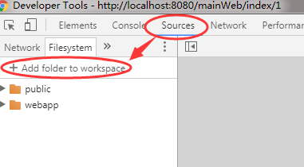
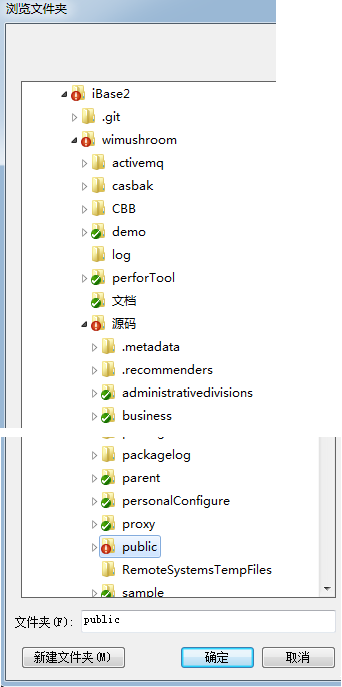
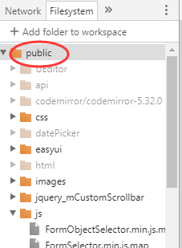
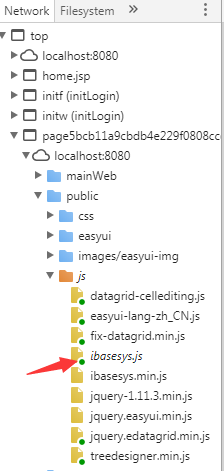

?> 压缩的js不但可大大减小文件尺寸（最高可达50%），运行也会提高性能，因此系统最好【引入的js都是压缩过的】。

但这样会对浏览器调试会带来一些困难，
下面提供三种方法来解决调试min.js脚本文件的问题。

#### 方法一
Chrome浏览器，打开“开发者工具”，点击“设置”，在“Sources”栏，勾上
Enable JavaScript source maps。

我们系统内所有js文件会同时带一个min.js的压缩版，如果引用的是压缩版文件，chrome会自动加载对应的map文件从而将源文件加载到运行环境。我们只需在源文件中设置断点即可。

#### 方法二
在调试时，将原始文件复制一份，改为压缩文件的命名，这样在调试环境下压缩与原始文件一致。这样就不用改页面中的真实引入代码，从而避免发布时因为忘了改回去的问题。唯一要记住的是在修改原始文件后，要重新复制替换压缩文件，以保持一致。

此方法适用本地调试，或可以修改发布系统中的文件的情况。

比如：在10.29服务器上，ibasesys.min.js代码出现问题，需要调试时，先将服务器的ibasesys.min.js删除，再将服务器上同目录的ibasesys.js文件复制一份，改名为ibasesys.min.js，刷新浏览器。

#### 方法三
在浏览器中打开压缩的.min.js文件，点击此窗口底部的“

”（即格式化）图标，可以将压缩文件格式化成正常代码（但变量名仍是压缩名），从而可实现设置断点调试。

此方法适用无法修改发布后系统中的文件的情况。

另外，在chrome浏览器中，如果在本地有对应目录结构的源js文件，可以实现在chrome浏览器的调试过程中即时修改代码。方法如下：

选择“Source”菜单，切换到“FileSystem”标签页，点击“Add folder to
workspace”，浏览找到要调试js文件的根文件夹（比如在页面中引入的js路径是：/public/js/ibasesys.js，那么选择我们源代码目录下的public目录即可），然后点击确定，即可添加进来。

1. 点击Sources面板，并且点击 `add floder to workspace`

2. 选择文件夹

（点确定后，会有一个授权提示，点击“允许”即可）

3. 查看匹配到的JS文件

（此时匹配到的js文件会有一个绿色的小圆点）

4. 查看JS文件

当然，如果页面引入文件所在目录与源代码目录不对应时，尽量保持目录层次一致，浏览器也可以通过js文件名自动对应。（比如在页面中引入的js路径是：/workflowWebService/js/details.js，那么选择我们源代码目录下的workflow/workflowWebService/src/main/webapp目录即可）。

通过以上设置，就可以边调试，边修改代码了。这些修改也会保存在本地文件中。
