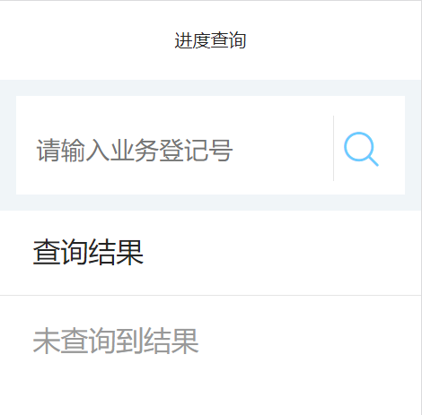
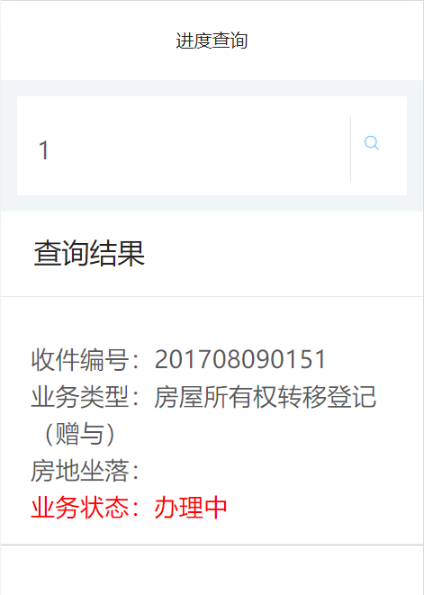

# 进度查询接口说明文档

<div style="float:right">

|作者|日期|
|----|---|
|郑烨锟|2019年3月27日|

</div>

## 进度查询页面

    这个页面是供用户根据业务登记号查询相关业务进度信息

####  接口1：查询内网业务的办理进度--GetYWJD
    
    用户输入业务登记号查询某个业务办理进度

> http://192.168.10.91:8071/WSYY/GetYWJD （string strJson）

*传入参数*
```json
{ 
    "DJBH":"201708090151" ,
    "password": "b7OmrnAjfyi42sOKCi3jtw1I1mw", 
    "username": "WSYYUSER"
}
```

> 此处为接口请求参数，参数主要是业务登记号：DJBH。

*返回参数*
```json
{
  "resultcode": "1",
  "resultmsg": "",
  "result": [{
    "jid": "201708090151",
    "jtitle": "房屋所有权转移登记（赠与）",
    "ffdzl": "云浮市市区城中路1号第七层",
    "ywjd": "办理中"
  }]
}
```

> 此接口返回数据表示，当resultcode=="1"时，存在业务进度数据。
    此页面是直接现在该业务进度数据。

## 实现图

#### 进度查询页面


#### 进度查询结果

