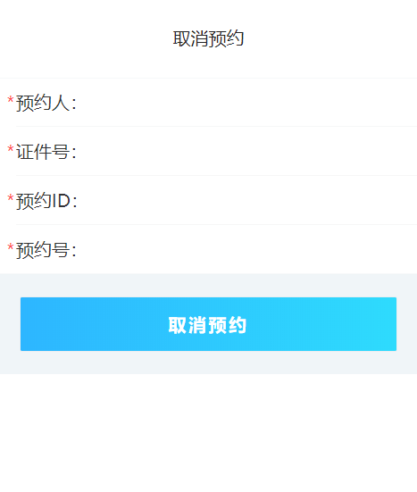
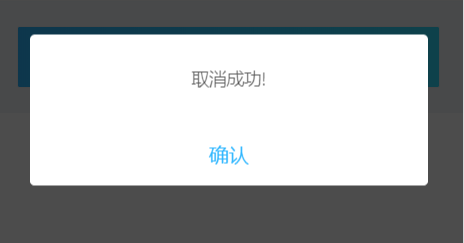

# 取消预约页面接口说明文档

<div style="float:right">

|作者|日期|
|----|---|
|郑烨锟|2019年3月27日|

</div>

## 取消预约页面

    这个页面是供已预约人取消预约业务

####  接口1：通过预约ID取消预约--CancelYYInfoByID
    
    预约人输入姓名、证件号、预约ID和预约号取消已预约业务

> http://192.168.10.91:8071/WSYY/CancelYYInfoByID （string strJson）

*传入参数*
```json
{ 
    "yyid":"101",
    "yyr": "张三", 
    "zjhm": "430421198709249373", 
    "qzhm": "", 
    "yyh": "", 
    "password": "b7OmrnAjfyi42sOKCi3jtw1I1mw", 
    "username": "WSYYUSER"
}
```

> 此处为接口请求参数，参数主要是预约ID：yyid；预约人名称：yyr；
    预约证件号码：zjhm；预约号：yyh。

*返回参数*
```json
{
    "resultcode": "1", 
    "resultmsg": "取消成功!"
}
```
 
> 此处为预约取消结果，如果验证通过，则弹框提示取消成功。

## 实现图

*取消预约页面*



*取消成功弹框*


