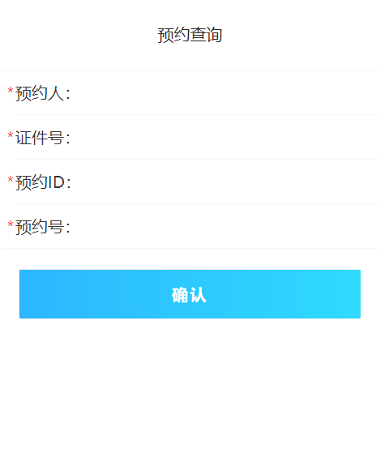
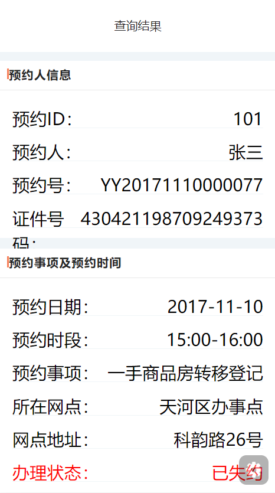

# 预约查询页面接口说明文档

<div style="float:right">

|作者|日期|
|----|---|
|郑烨锟|2019年3月27日|

</div>

## 预约查询页面

    这个页面是供已预约人查询个人预约事项相关信息

####  接口1：预约信息查询--SearchYYInfo
    
    预约人输入姓名、证件号、预约ID和预约号查询已预约详情信息。
    一般情况可直接使用预约人姓名，身份证号码查询，
    如果传入YYID预约ID字段，则优先使用YYID查询。

> http://192.168.10.91:8071/WSYY/SearchYYInfo （string strJson）

*传入参数*
```json
{ 
    "yyid":"101",
    "yyr": "张三", 
    "zjhm": "430421198709249373", 
    "qzhm": "", 
    "yyh": "", 
    "password": "b7OmrnAjfyi42sOKCi3jtw1I1mw", 
    "username": "WSYYUSER"
}
```

> 此处为接口请求参数，参数主要是预约ID：yyid；预约人名称：yyr；
    预约证件号码：zjhm；预约号：yyh。

*返回参数*
```json
{
  "resultcode": "1",
  "resultmsg": "查询成功!",
  "yyinfo": [{
    "id": "101",
    "yyr": "张三",
    "zjhm": "430421198709249373",
    "yysx": "一手商品房转移登记",
    "szwd": "天河区办事点",
    "bdczl": "",
    "zmh": "123",
    "yyrq": "2017-11-10",
    "yysd": "15:00-16:00",
    "yyh": "YY20171110000077",
    "zt": "已失约",
    "ph": "",
    "wddz": "科韵路26号"
  }]
}
```
 
> 此处为预约查询结果，通过跳转到查询结果页面显示已预约详细信息

## 实现图

*预约查询页面*



*预约查询结果页面*


