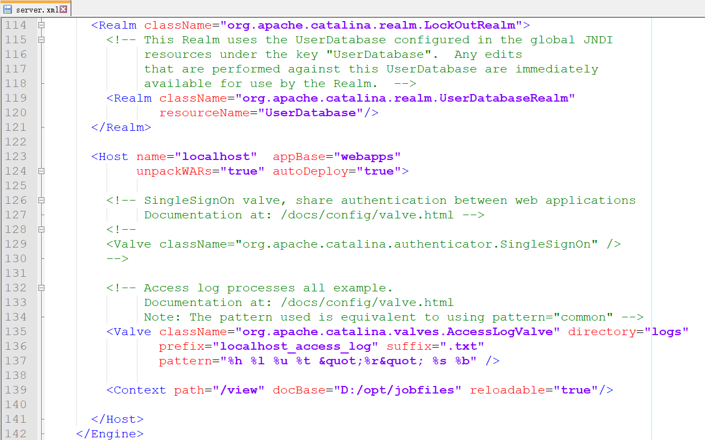
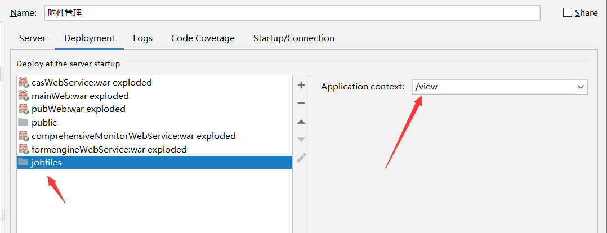
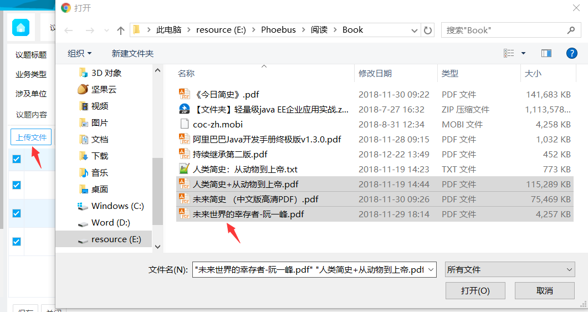
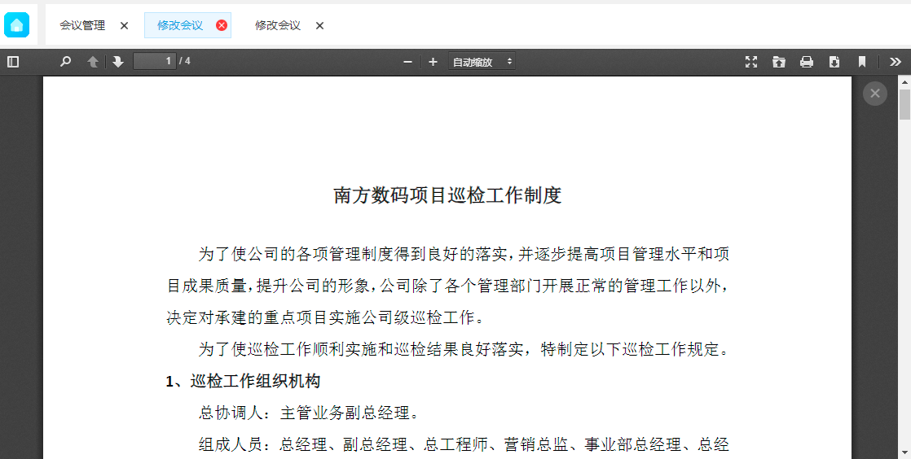
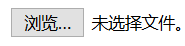
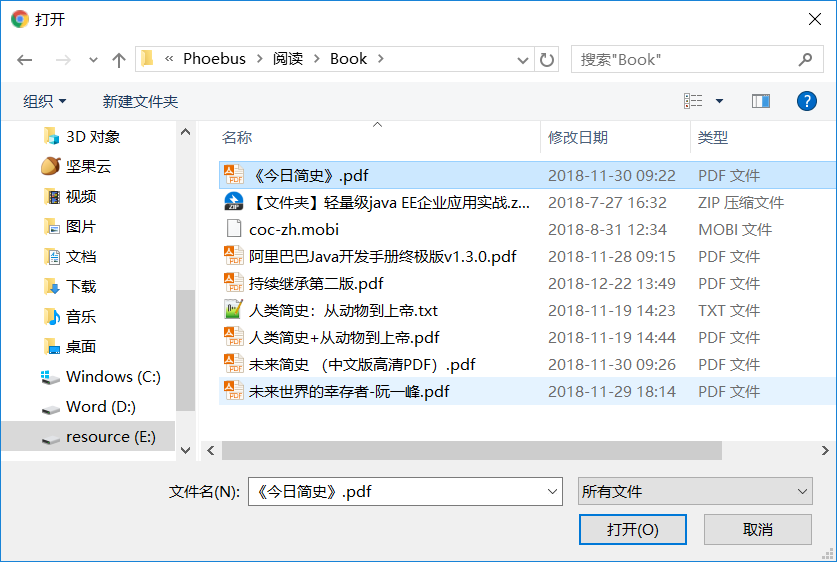
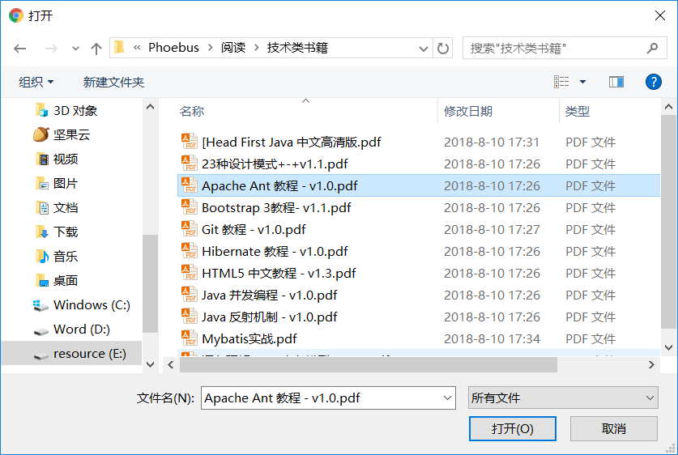
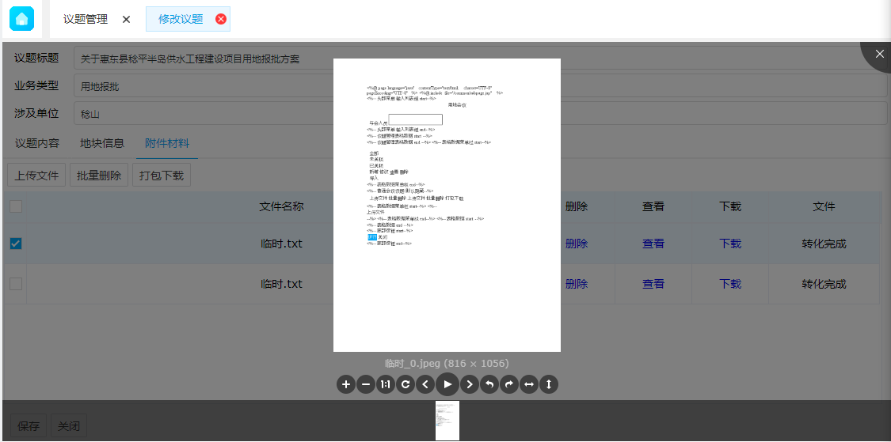
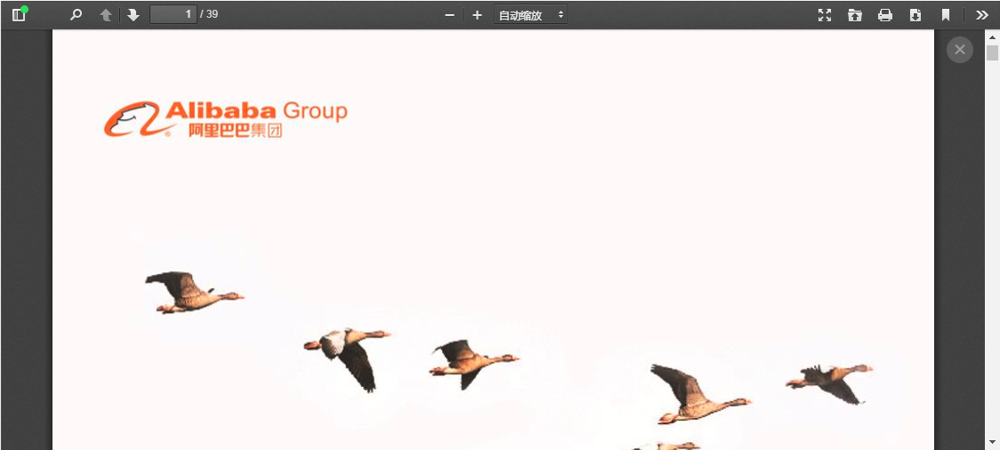

# 附件管理

### 配置

*   预览配置
        *   本地配置
            *   1、配置保存的文件路径
                *   D:\\opt\\jobfiles
                    *   预览图片保存在：D:\\opt\\jobfiles\\preview
                *   如果直接是由外置tomcat运行项目（模块），则在所用的tomcat文件配置映射路径
                    *   tomcat：conf文件下server.xml
                        *   D:\\develop\\tool\\apps\\tomcat\\conf\\server.xml
                    *   <Context path="/view" docBase="D:/opt/jobfiles" reloadable="true"/>
                        *   直接在最后添加这行配置
                            
                            
                            
                *   如果像IDEA IntelliJ使用内置tomcat(虚拟)运行模块
                    *   添加模块文件（在添加模块处）
                        *   添加模块D:\\opt\\jobfiles
                        *   模块名为：view
                        *   意思是遇到/view路径访问时映射到这里（到这里路径下找）
                            
                            
                            
### 上传附件

*   代码
    ```html
     <!-- 真实按钮：给用户点的 -->
     <a class="easyui-linkbutton confirm-button" data-options="iconCls:'icon-import1'" onclick="uploadFunc.uploadFile('upload')">上传文件</a>
     <!-- 选择文件弹框 -->
     <input id="mFile_upload" name="mFile" type="file" style="display:none;" multiple="multiple" onChange="uploadFunc['uploadFileOnchange']('upload','upload')"/>
     <input id="upload" name="upload" data-widget="filebox" multiple="multiple" style="display:none;" onchange="loadDataChange(this.value,true,'upload','upload')"/>
    ```
    ```javascript
    // 判断上传操作
    uploadFile: function (suffix) {
        var sufid = suffix.replace(/\./g, "-").replace(/\$/g, "-");
        return $('#mFile_' + sufid).click();
    },
    // 判断上传文件状态，并保存文件
    uploadFileOnchange: function (fname, prefix) {
        var keyName = topicDetail.keyName;
        if (!keyName) {
            showError("无法上传附件！");
            return;
        }
        uploadPermit = false;
        var sufid = fname.replace(/\./g, "-").replace(/\$/g, "-");
        var files = $(document.getElementById("mFile_" + sufid))[0].files;
        var fileDataGrid = $('#attachmentList');
        for (var i = 0; i < files.length; i++) {
            fileDataGrid.datagrid('appendRow', {
                fileName: files[i].name,
                uploadState: ''
            });
        }
        // 获取所有添加行的行号
        var data = fileDataGrid.datagrid('getData');
        var arr = [];
        var total = data.total;
        for (var i = files.length; i > 0; i--) {
            arr.push(total - i);
        }
        // 处理ajaxupload特殊符号$无法解析
        $.ajaxFileUpload({
            url: '/formengineWebService/uploadFiles?jid=' + keyName,
            fileElementId: 'mFile_' + sufid,
            type: 'POST',
            dataType: 'json',
            secureuri: false,
            success: function (filePaths, status) {
                if (filePaths === undefined) {
                    console.log("result 不正  确", filePaths);
                }
                if (filePaths == null || filePaths === '') {
                    showError("上传附件失败");
                    uploadPermit = true;
                    document.getElementById("mFile_" + sufid).value = "";
                    return;
                }
                for (var i = 0; i < files.length; i++) {
                    var fileName = files[i].name;
                    // 获取文件类型
                    var lastIndex = fileName.lastIndexOf(".");
                    var fileType;
                    if (lastIndex < fileName.length - 1) {
                        fileType = fileName.substring(lastIndex).toLowerCase();
                    } else {
                        fileType = "";
                    }
                    var result = $(document.getElementById(fname)).val();
                    $(document.getElementById(fname)).val(uploadFunc.removeSpace(fileName) + "|" + filePaths[i] + "::" + result);
                    // 根据文件类型设置状态栏的内容，如果不支持预览提示用户“文件不支持预览”，否则提示“图片转化中”
                    var content;
                    if ($.inArray(fileType, previewImgTypes) >= 0) {
                        content = -2;// -2 正在上传
                    } else {
                        content = -3;// -3 不支持预览
                    }
                    // 修改附件状态
                    fileDataGrid.datagrid('updateRow', {
                        index: arr[i],
                        row: {
                            filePath: filePaths[i],
                            uploadState: content
                        }
                    })
                }
                // 去除隐藏input的value值得最后一个 | 符号
                var str = $(document.getElementById(fname)).val();
                if (str.substr(str.length - 2, 2) === "::") {
                $(document.getElementById(fname)).val(str.substring(0, str.length - 2));
                }
                var newVal = $(document.getElementById(fname)).val().split("::");
                var FJSL = fname.split(".")[0] + ".FSL";
                // $.F.setFieldValue(FJSL,newVal.length);
                document.getElementById("mFile_" + sufid).value = "";
                uploadPermit = true;
                uploadFunc.startGetFileConvertState($('#attachmentList'));
                // 上传成功后刷新datagrid
                $('#attachmentList').datagrid('reload');
            },
            error: function (xhr, status, e) {
                flag = false;
                uploadPermit = true;
                showAjaxError(xhr, status, e, "上传附件失败!");
                document.getElementById("mFile_" + sufid).value = "";
            }
    });
    ```
    *   实现思路
        *   1、选择文件
            *   用户点击上传文件，触发打开选择上传文件弹框事件，
                ```html
                <a class="easyui-linkbutton confirm-button" data-options="iconCls:'icon-import1'" onclick="uploadFunc.uploadFile('upload')">上传文件</a>
                ```
                ```javascript
                // 判断上传操作
                uploadFile: function (suffix) {
                var sufid = suffix.replace(/\./g, "-").replace(/\$/g, "-");
                // 此时拼接出来的是mFile_upload，触发这个input事件：uploadFileOnchange方法
                return $('#mFile_' + sufid).click();
                },
                ```
                *   // 此处HTML代码表示
                ```html
                <input id="mFile_upload" name="mFile" type="file" style="display:none;" multiple="multiple" onChange="uploadFunc['uploadFileOnchange']('upload','upload')"/>
                ```                    
                *   // 用户点击按钮后到这个方法中
                *   uploadFileOnchange: function (fname, prefix) {
                    *   当双击文件或选中文件打开确定上传（可多选）
                        
                        
                        
                *   }
        *   2、文件上传
            *   uploadFileOnchange: function (fname, prefix) {
                *   将指定ID域的文件上传（也就是将选中的文件上传到指定接口）
                    ```javascript
                    $.ajaxFileUpload({
                        url: '/formengineWebService/uploadFiles?jid=' + keyName,
                        fileElementId: 'mFile_' + sufid,
                        type: 'POST',
                        dataType: 'json',
                        secureuri: false,
                        success: function (filePaths, status) {
                            // 上传成功后执行（根据接口返回值判断文件上传状态）
                            // 正常会显示上传附件成功
                        },
                        error: function (xhr, status, e) {
                            flag = false;
                            uploadPermit = true;
                            showAjaxError(xhr, status, e, "上传附件失败!");
                            document.getElementById("mFile_" + sufid).value = "";
                        }
                    });
                    ```
            *   }
            > 接口处收到文件后会解析处理，将文件存入某个文件路径，并返回对应的状态值

*   预览

*   预览js
    ```javascript
    // 预览图片
    previewImage: function (filePath) {
            if (!filePath) {
                showError("文件正在上传，请稍后处理", "提示");
                return;
            }
            var filePaths = [];
            filePaths.push(filePath);
            if (!filePaths || filePaths.length === 0) {
                showError("预览传入的参数为空");
                return;
            }
            var imgPaths = [];
            for (var i = 0; i < filePaths.length; i++) {
                var filePath = filePaths[i];
                var sExt = filePath.substr(filePath.lastIndexOf(".")).toLowerCase();
                // 判断文件是否支持预览
                var index = $.inArray(sExt, previewImgTypes);
                if (index >= 0) {
                    imgPaths.push(filePath);
                }
            }
            if (imgPaths.length === 0) {
                showError("这类文件不支持预览", '提示');
                return;
            }
            //预览开始位置
            var preIndex = 0;
            $.ajax({
                url: '/formengineWebService/getImagesByFilePaths',
                type: 'post',
                dataType: 'json',
                data: {
                    macroPaths: imgPaths
                },
                success: function (data) {
                    //渲染预览页面
                    var renderPage = function (previewHtml) {
                        $('#unittab').tabs('close', 3);
                        $('#unittab').tabs('add', {
                            title: '图片预览',
                            selected: true,
                            closable: true,
                            id: 'previewImgTab',
                            width: '100%',
                            height: '100%',
                            content: previewHtml
                        });
                    };
                    if (sExt === ".pdf") {
                        var pdfHtml = '<div style="width: 100%;height: 100%;overflow: hidden;"><iframe src="/pubWeb/static/web/viewer.html?file=' + encodeURIComponent(data['result'][0]) + '" id="pdfContainer" name="pdfContainer" style="width:100%;height:100%;box-sizing:border-box;"></iframe></div>';
                        renderPage(pdfHtml); //渲染pdf预览页面
                    } else {
                        if (data.result.length === 0) {
                            showError("预览图片还未生成或预览图丢失！", "提示");
                            return;
                        }
                        var html = [];
                        var content = "";
                        if (data.msg) {
                            content = "(" + data.msg + ")";
                        }
                        for (var i = 0; i < data.result.length; i++) {
                            var index = data.result[i].lastIndexOf('/');
                            var filename = data.result[i].substring(index + 1);
                            var prefix = data.result[i].substring(0, index + 1);
                            html.push("<li>")
                            html.push('');
                            html.push("</li>");
                        }
                        var otherHtml = '<ul id="previewImg" class="previewimg"></ul>';
                        renderPage(otherHtml);
                        //清空预览插件中的图片
                        $("#previewImg").empty();
                        $("#previewImg").viewer('destroy');
                        $("#previewImg").append(html.join(''));
                        $("#previewImg").viewer({
                            // inline: true,
                            shown: function () {
                                $("#previewImg").viewer('view', preIndex);
                            }
                        });
                        $("#previewImg").viewer('show');
                        // $('#unitdialog')[0].parentElement.style.overflow = 'unset';
                    }
                },
                error: function (xhr, stat, exmsg) {
                    showAjaxError(xhr, stat, exmsg, "获取预览图片失败");
                }
            });
        },
    ```
       
*   图片预览
    *   HTML
        *   <!\-\- 图片预览 -->
        *   <div>
            *   <ul class="images" id="previewImg" style="display:none;"></ul>
        *   </div>
    *   预览思路
        *   查看按钮中存在图片路径
        *   根据图片路径去让这个接口去找到图片返回
            *   url: '/formengineWebService/getImagesByFilePaths',
        *   然后使用viewer这个插件展示
            ```javascript
            //清空预览插件中的图片
            $("#previewImg").empty();
            $("#previewImg").viewer('destroy');
            $("#previewImg").append(html.join(''));
            $("#previewImg").viewer({
                // inline: true,
                shown: function () {
                    $("#previewImg").viewer('view', preIndex);
                }
            });
            $("#previewImg").viewer('show');
            ```
*   PDF预览
    *   HTML
        ```html
        <!-- PDF预览：div为关闭PDF×按钮 -->
        <div id="previewDiv" class="preview-div">
            <a class="close-btn" onclick="uploadFunc.closePdf()">×</a>
            <iframe src="" frameborder="0" class="pdf-container" id="pdfContainer" name="pdfContainer"></iframe>
        </div>
        ```
    *   预览思路
        *   虽然是PDF预览，但预览存储的是PDF文件，并依然存到图片预览一样的路径中
            *   D:\\opt\\jobfiles\\preview
        *   判断是PDF预览后会将文件（文件路径）作为参数请求到viewer.html文件中
            *   pubWeb/static/web/viewer.html?file=%2Fview%2Fpreview%2F201901%2Ff782C95A079F93F46A50%2F73d64404-c916-4dd2-af5f-b128c982f112%2F%E9%99%84%E4%BB%B6%EF%BC%9B%E5%8D%97%E6%96%B9%E6%95%B0%E7%A0%81%E9%A1%B9%E7%9B%AE%E5%B7%A1%E6%A3%80%E5%B7%A5%E4%BD%9C%E5%88%B6%E5%BA%A6.pdf
        *   由viewer.html解析并返回一个PDF预览页面置顶覆盖整个页面
            
            
            
        *   故需要手动创建一个关闭按钮（×），方便回到原来的页面（预览前）

*   删除附件
    *   这一步最简单，在上传后获取附件列表时会将附件的id保存在前端（或元素上），当用户点击删除附件时，将附件的id传到后台，后台会根据需要做删除（真删除或假删除（假删除的话就是修改文件状态值就行了））
    *   批量删除也是一回事，拼接选中的附件的id作为字符串传给后台，后台会解析后循环删除
*   下载附件
    *   下载分为单个文件下载和多个文件打包下载
    *   单文件下载
        *   这个比较简单
        *   参考实现
            *   直接生成隐藏form元素进行
            ```javascript
            var form = $("<form>");// 定义一个form表单form.attr("style", "display:none");
            form.attr("target", "");
            form.attr("method", "post");
            form.attr("action", '/formengineWebService/downFileByPath');
            var fileNameInput = $("<input>");
            fileNameInput.attr("type", "hidden");
            fileNameInput.attr("id", "fileName");// 设置属性的名字fileNameInput.attr("name", "fileName");// 设置属性的名字fileNameInput.attr("value", fileName);// 设置属性的值var filePathInput = $("<input>");
            filePathInput.attr("type", "hidden");
            filePathInput.attr("id", "macroPath");// 设置属性的名字filePathInput.attr("name", "macroPath");// 设置属性的名字filePathInput.attr("value", filePath);// 设置属性的值$("body").append(form);// 将表单放置在web中form.append(fileNameInput);
            form.append(filePathInput);
            form.submit().remove();// 表单提交
            ```
        *   后台直接返回文件给浏览器，浏览器会提示下载文件
    *   打包下载
        *   参考实现
            ```javascript
            // 获取所有选中文件路径
            var macroPath = [];
            macroPath.push(encodeURIComponent(rows[i]['fileName']) + '|' + uploadFunc.removeSpace(rows[i]['filePath']));
            var form = $("<form>");// 定义一个form表单form.attr("style", "display:none");
            form.attr("target", "");
            form.attr("method", "post");
            form.attr("action", '/formengineWebService/downFiles');
            var macroPathInput = $("<input>");
            macroPathInput.attr("type", "hidden");
            macroPathInput.attr("id", "macroPath");// 设置属性的名字macroPathInput.attr("name", "macroPath");// 设置属性的名字macroPathInput.attr("value", macroPath);// 设置属性的值$("body").append(form);// 将表单放置在web中form.append(macroPathInput);
            form.submit().remove();// 表单提交
            ```
        *   由后台处理打包压缩返回所有要下载的文件到浏览器，浏览器会提示下载
*   插件
    *   使用插件
        *   ajaxfileupload.min.js
        *   viewer.js
        *   pdf.js
    *   插件详情
        *   预览图片
            *   viewer.js
                *   [http://fengyuanchen.github.io/viewer/](http://fengyuanchen.github.io/viewer/)
                *   viewer.css
                *   viewer.js
                *   [https://github.com/fengyuanchen/viewer](https://github.com/fengyuanchen/viewer)
            *   语法
                *   Methods
                    *   View
                        *   查看预览
                    *   Zoom
                        *   指定倍数放大
                    *   Zoom In
                        *   指定倍数放大
                    *   Zoom To
                        *   放大指定倍数
                    *   Zoom Out
                        *   缩小指定倍数
                    *   Rotate
                        *   指定度数旋转
                    *   Rotate To
                        *   旋转到指定度数
                    *   Rotate Left
                        *   逆时针向左旋转90°
                    *   Rotate Rigft
                        *   顺时针向右旋转90°
                    *   Flip horizontal
                        *   图片上下180°翻转（图片内容向上转为向下，向下转为向上）
                    *   Flip vertical
                        *   图片对翻180°（图片原在左边向左变为在右边向右）
                    *   移动图片
                        *   Left
                            *   向左移动图片
                        *   Right
                            *   向右移动图片
                        *   Up
                            *   向上移动图片
                        *   Down
                            *   向右移动图片
                    *   prev
                        *   View previous image
                        *   还原到图片默认大小
                    *   Next
                        *   查看下个图片
                    *   Play
                        *   动画幻灯片播放
                    *   Stop
                        *   停止幻灯片播放
                    *   Show
                        *   显示图片后执行的方法（回调）
                        *   $("#previewImg").viewer({
                            *   //inline: true,
                            *   shown: function () {
                                *   // 默认显示下标为preIndex的预览图片
                                *   $("#previewImg").viewer('view', preIndex);
                            *   }
                        *   });
                        *   // 启动预览
                        *   $("#previewImg").viewer('show');
                    *   Hide
                        *   隐藏图片后执行的方法（回调）
                        *   $("#previewImg").viewer({
                            *   //inline: true,
                            *   hide: function () {
                                *   // 图片隐藏后执行回调
                            *   }
                        *   });
                    *   Full
                        *   全屏预览
                    *   Exit
                        *   取消全屏预览
                    *   Reset
                        *   重置原先大小（或说上次保存的大小）
                    *   Tooltip
                        *   提示信息
                    *   Destroy
                        *   // 清空预览插件中的图片
            *   使用
                *   HTML代码
                ```html
                <!-- 图片预览 -->
                <!-- ul表示每次预览可以有多张预览图片li -->
                <div>
                    <ul class="images" id="previewImg" style="display:none;"></ul>
                </div>
                ```
                *   参考代码
                ```javascript
                // 预览开始位置
                var preIndex = 0;
                $.ajax({
                    url: '/formengineWebService/getImagesByFilePaths',
                    type: 'post',
                    dataType: 'json',
                    data: {macroPaths: imgPaths},
                    success: function (data) {
                        if (data === undefined) {
                            console.log("result 不正确", data);
                            return;
                        }
                        if(sExt === '.pdf'){
                            $('#previewDiv')[0].style.display = 'block';
                            $('#pdfContainer')[0].src = "/pubWeb/static/web/viewer.html?file=" + encodeURIComponent(data['result'][0]);
                        }else{
                            if (data.result.length === 0) {
                                showError("预览图片还未生成或预览图丢失！", "提示");
                                return;
                            }
                            var html = [];
                            var content = "";
                            if (data.msg) {
                                content = "(" + data.msg + ")";
                            }
                            for (var i = 0; i < data.result.length; i++) {
                                var index = data.result[i].lastIndexOf('/');
                                var filename = data.result[i].substring(index + 1);
                                var prefix = data.result[i].substring(0, index + 1);
                                html.push("<li>");
                                html.push('');
                                html.push("</li>");
                            }
                            // 清空预览插件中的图片 $("#previewImg").empty();
                            $("#previewImg").viewer('destroy');
                            $("#previewImg").append(html.join(''));
                            $("#previewImg").viewer({
                                // inline: true,
                                shown: function () {
                                    $("#previewImg").viewer('view', preIndex);
                                }
                            });
                            $("#previewImg").viewer('show');
                            // $('#unitdialog')[0].parentElement.style.overflow = 'unset';
                        }
                    },
                    error: function (xhr, stat, exmsg) {
                        showAjaxError(xhr, stat, exmsg, "获取预览图片失败");
                    }
                });
                ```
                *   图片预览
                    *   生成预览HTML
                    ```html
                    var html = [];
                    var content = "";
                    if (data.msg) {
                        content = "(" + data.msg + ")";
                    }
                    for (var i = 0; i < data.result.length; i++) {
                        var index = data.result[i].lastIndexOf('/');
                        var filename = data.result[i].substring(index + 1);
                        var prefix = data.result[i].substring(0, index + 1);
                        html.push("<li>");
                        // 拼接图片地址
                        html.push('');
                        html.push("</li>");
                    }
                    // 清空预览插件中的图片
                        $("#previewImg").empty();
                        $("#previewImg").viewer('destroy');
                        $("#previewImg").append(html.join(''));
                    设置第一张预览图片
                        $("#previewImg").viewer({
                            //inline: true,
                            shown: function () {
                                // 默认显示下标为preIndex的预览图片
                                $("#previewImg").viewer('view', preIndex);
                            }
                        });
                    // 启动预览
                    $("#previewImg").viewer('show');
                    ```
                    
                *   PDF预览
                    *   HTML代码
                    ```html
                    <!\-\- PDF预览 -->
                    <!\-\- 用于生成关闭按钮，关闭当前PDF预览 -->
                    <div id="previewDiv" class="preview-div">
                        <a class="close-btn" onclick="uploadFunc.closePdf()">×</a>
                        <iframe src="" frameborder="0" class="pdf-container" id="pdfContainer" name="pdfContainer"></iframe>
                    </div>
                    ```
                        *   viewer.html
                       
                       ```html
                        <!DOCTYPE html>
                        <html dir="ltr" mozdisallowselectionprint moznomarginboxes>
                        <head>
                        <meta charset="utf-8">
                        <meta name="viewport" content="width=device-width, initial-scale=1, maximum-scale=1">
                        <meta name="google" content="notranslate">
                        <meta http-equiv="X-UA-Compatible" content="IE=edge">
                        <title>PDF.js viewer</title>
                        <link rel="stylesheet" href="viewer.css">
                        <link rel="resource" type="application/l10n" href="locale/locale.properties">
                        <script src="/public/pdf/pdf.js"></script>
                        <script src="viewer.js"></script>
                        </head>
                        <body tabindex="1" class="loadingInProgress">
                        <div id="outerContainer">
                        <div id="sidebarContainer">
                        <div id="toolbarSidebar">
                        <div class="splitToolbarButton toggled">
                        <button id="viewThumbnail" class="toolbarButton toggled" title="Show Thumbnails" tabindex="2" data-l10n-id="thumbs">
                        <span data-l10n-id="thumbs_label">Thumbnails</span>
                        </button>
                        <button id="viewOutline" class="toolbarButton" title="Show Document Outline (double-click to expand/collapse all items)" tabindex="3" data-l10n-id="document_outline">
                        <span data-l10n-id="document\_outline\_label">Document Outline</span>
                        </button>
                        <button id="viewAttachments" class="toolbarButton" title="Show Attachments" tabindex="4" data-l10n-id="attachments">
                        <span data-l10n-id="attachments_label">Attachments</span>
                        </button>
                        </div>
                        </div>
                        <div id="sidebarContent">
                        <div id="thumbnailView">
                        </div>
                        <div id="outlineView" class="hidden">
                        </div>
                        <div id="attachmentsView" class="hidden">
                        </div>
                        </div>
                        </div> <!-- sidebarContainer -->
                        
                        <div id="mainContainer">
                        <div class="findbar hidden doorHanger" id="findbar">
                        <div id="findbarInputContainer">
                        <input id="findInput" class="toolbarField" title="Find" placeholder="Find in document…" tabindex="91" data-l10n-id="find_input">
                        <div class="splitToolbarButton">
                        <button id="findPrevious" class="toolbarButton findPrevious" title="Find the previous occurrence of the phrase" tabindex="92" data-l10n-id="find_previous">
                        <span data-l10n-id="find\_previous\_label">Previous</span>
                        </button>
                        <div class="splitToolbarButtonSeparator"></div>
                        <button id="findNext" class="toolbarButton findNext" title="Find the next occurrence of the phrase" tabindex="93" data-l10n-id="find_next">
                        <span data-l10n-id="find\_next\_label">Next</span>
                        </button>
                        </div>
                        </div>
                        <div id="findbarOptionsContainer">
                        <input type="checkbox" id="findHighlightAll" class="toolbarField" tabindex="94">
                        <label for="findHighlightAll" class="toolbarLabel" data-l10n-id="find_highlight">Highlight all</label>
                        <input type="checkbox" id="findMatchCase" class="toolbarField" tabindex="95">
                        <label for="findMatchCase" class="toolbarLabel" data-l10n-id="find\_match\_case_label">Match case</label>
                        <span id="findResultsCount" class="toolbarLabel hidden"></span>
                        </div>
                        <div id="findbarMessageContainer">
                        <span id="findMsg" class="toolbarLabel"></span>
                        </div>
                        </div> <!-- findbar -->
                        
                        <div id="secondaryToolbar" class="secondaryToolbar hidden doorHangerRight">
                        <div id="secondaryToolbarButtonContainer">
                        <button id="secondaryPresentationMode" class="secondaryToolbarButton presentationMode visibleLargeView" title="Switch to Presentation Mode" tabindex="51" data-l10n-id="presentation_mode">
                        <span data-l10n-id="presentation\_mode\_label">Presentation Mode</span>
                        </button>
                        <button id="secondaryOpenFile" class="secondaryToolbarButton openFile visibleLargeView" title="Open File" tabindex="52" data-l10n-id="open_file">
                        <span data-l10n-id="open\_file\_label">Open</span>
                        </button>
                        <button id="secondaryPrint" class="secondaryToolbarButton print visibleMediumView" title="Print" tabindex="53" data-l10n-id="print">
                        <span data-l10n-id="print_label">Print</span>
                        </button>
                        <button id="secondaryDownload" class="secondaryToolbarButton download visibleMediumView" title="Download" tabindex="54" data-l10n-id="download">
                        <span data-l10n-id="download_label">Download</span>
                        </button>
                        <a href="#" id="secondaryViewBookmark" class="secondaryToolbarButton bookmark visibleSmallView" title="Current view (copy or open in new window)" tabindex="55" data-l10n-id="bookmark">
                        <span data-l10n-id="bookmark_label">Current View</span>
                        </a>
                        <div class="horizontalToolbarSeparator visibleLargeView"></div>
                        <button id="firstPage" class="secondaryToolbarButton firstPage" title="Go to First Page" tabindex="56" data-l10n-id="first_page">
                        <span data-l10n-id="first\_page\_label">Go to First Page</span>
                        </button>
                        <button id="lastPage" class="secondaryToolbarButton lastPage" title="Go to Last Page" tabindex="57" data-l10n-id="last_page">
                        <span data-l10n-id="last\_page\_label">Go to Last Page</span>
                        </button>
                        <div class="horizontalToolbarSeparator"></div>
                        <button id="pageRotateCw" class="secondaryToolbarButton rotateCw" title="Rotate Clockwise" tabindex="58" data-l10n-id="page\_rotate\_cw">
                        <span data-l10n-id="page\_rotate\_cw_label">Rotate Clockwise</span>
                        </button>
                        <button id="pageRotateCcw" class="secondaryToolbarButton rotateCcw" title="Rotate Counterclockwise" tabindex="59" data-l10n-id="page\_rotate\_ccw">
                        <span data-l10n-id="page\_rotate\_ccw_label">Rotate Counterclockwise</span>
                        </button>
                        <div class="horizontalToolbarSeparator"></div>
                        <button id="cursorSelectTool" class="secondaryToolbarButton selectTool toggled" title="Enable Text Selection Tool" tabindex="60" data-l10n-id="cursor\_text\_select_tool">
                        <span data-l10n-id="cursor\_text\_select\_tool\_label">Text Selection Tool</span>
                        </button>
                        <button id="cursorHandTool" class="secondaryToolbarButton handTool" title="Enable Hand Tool" tabindex="61" data-l10n-id="cursor\_hand\_tool">
                        <span data-l10n-id="cursor\_hand\_tool_label">Hand Tool</span>
                        </button>
                        <div class="horizontalToolbarSeparator"></div>
                        <button id="documentProperties" class="secondaryToolbarButton documentProperties" title="Document Properties…" tabindex="62" data-l10n-id="document_properties">
                        <span data-l10n-id="document\_properties\_label">Document Properties…</span>
                        </button>
                        </div>
                        </div> <!-- secondaryToolbar -->
                        
                        <div class="toolbar">
                        <div id="toolbarContainer">
                        <div id="toolbarViewer">
                        <div id="toolbarViewerLeft">
                        <button id="sidebarToggle" class="toolbarButton" title="Toggle Sidebar" tabindex="11" data-l10n-id="toggle_sidebar">
                        <span data-l10n-id="toggle\_sidebar\_label">Toggle Sidebar</span>
                        </button>
                        <div class="toolbarButtonSpacer"></div>
                        <button id="viewFind" class="toolbarButton" title="Find in Document" tabindex="12" data-l10n-id="findbar">
                        <span data-l10n-id="findbar_label">Find</span>
                        </button>
                        <div class="splitToolbarButton hiddenSmallView">
                        <button class="toolbarButton pageUp" title="Previous Page" id="previous" tabindex="13" data-l10n-id="previous">
                        <span data-l10n-id="previous_label">Previous</span>
                        </button>
                        <div class="splitToolbarButtonSeparator"></div>
                        <button class="toolbarButton pageDown" title="Next Page" id="next" tabindex="14" data-l10n-id="next">
                        <span data-l10n-id="next_label">Next</span>
                        </button>
                        </div>
                        <input type="number" id="pageNumber" class="toolbarField pageNumber" title="Page" value="1" size="4" min="1" tabindex="15" data-l10n-id="page">
                        <span id="numPages" class="toolbarLabel"></span>
                        </div>
                        <div id="toolbarViewerRight">
                        <button id="presentationMode" class="toolbarButton presentationMode hiddenLargeView" title="Switch to Presentation Mode" tabindex="31" data-l10n-id="presentation_mode">
                        <span data-l10n-id="presentation\_mode\_label">Presentation Mode</span>
                        </button>
                        <button id="openFile" class="toolbarButton openFile hiddenLargeView" title="Open File" tabindex="32" data-l10n-id="open_file">
                        <span data-l10n-id="open\_file\_label">Open</span>
                        </button>
                        <button id="print" class="toolbarButton print hiddenMediumView" title="Print" tabindex="33" data-l10n-id="print">
                        <span data-l10n-id="print_label">Print</span>
                        </button>
                        <button id="download" class="toolbarButton download hiddenMediumView" title="Download" tabindex="34" data-l10n-id="download">
                        <span data-l10n-id="download_label">Download</span>
                        </button>
                        <a href="#" id="viewBookmark" class="toolbarButton bookmark hiddenSmallView" title="Current view (copy or open in new window)" tabindex="35" data-l10n-id="bookmark">
                        <span data-l10n-id="bookmark_label">Current View</span>
                        </a>
                        <div class="verticalToolbarSeparator hiddenSmallView"></div>
                        <button id="secondaryToolbarToggle" class="toolbarButton" title="Tools" tabindex="36" data-l10n-id="tools">
                        <span data-l10n-id="tools_label">Tools</span>
                        </button>
                        </div>
                        <div id="toolbarViewerMiddle">
                        <div class="splitToolbarButton">
                        <button id="zoomOut" class="toolbarButton zoomOut" title="Zoom Out" tabindex="21" data-l10n-id="zoom_out">
                        <span data-l10n-id="zoom\_out\_label">Zoom Out</span>
                        </button>
                        <div class="splitToolbarButtonSeparator"></div>
                        <button id="zoomIn" class="toolbarButton zoomIn" title="Zoom In" tabindex="22" data-l10n-id="zoom_in">
                        <span data-l10n-id="zoom\_in\_label">Zoom In</span>
                        </button>
                        </div>
                        <span id="scaleSelectContainer" class="dropdownToolbarButton">
                        <select id="scaleSelect" title="Zoom" tabindex="23" data-l10n-id="zoom">
                        <option id="pageAutoOption" title="" value="auto" selected="selected" data-l10n-id="page\_scale\_auto">Automatic Zoom</option>
                        <option id="pageActualOption" title="" value="page-actual" data-l10n-id="page\_scale\_actual">Actual Size</option>
                        <option id="pageFitOption" title="" value="page-fit" data-l10n-id="page\_scale\_fit">Page Fit</option>
                        <option id="pageWidthOption" title="" value="page-width" data-l10n-id="page\_scale\_width">Page Width</option>
                        <option id="customScaleOption" title="" value="custom" disabled="disabled" hidden="true"></option>
                        <option title="" value="0.5" data-l10n-id="page\_scale\_percent" data-l10n-args='{ "scale": 50 }'>50%</option>
                        <option title="" value="0.75" data-l10n-id="page\_scale\_percent" data-l10n-args='{ "scale": 75 }'>75%</option>
                        <option title="" value="1" data-l10n-id="page\_scale\_percent" data-l10n-args='{ "scale": 100 }'>100%</option>
                        <option title="" value="1.25" data-l10n-id="page\_scale\_percent" data-l10n-args='{ "scale": 125 }'>125%</option>
                        <option title="" value="1.5" data-l10n-id="page\_scale\_percent" data-l10n-args='{ "scale": 150 }'>150%</option>
                        <option title="" value="2" data-l10n-id="page\_scale\_percent" data-l10n-args='{ "scale": 200 }'>200%</option>
                        <option title="" value="3" data-l10n-id="page\_scale\_percent" data-l10n-args='{ "scale": 300 }'>300%</option>
                        <option title="" value="4" data-l10n-id="page\_scale\_percent" data-l10n-args='{ "scale": 400 }'>400%</option>
                        </select>
                        </span>
                        </div>
                        </div>
                        <div id="loadingBar">
                        <div class="progress">
                        <div class="glimmer">
                        </div>
                        </div>
                        </div>
                        </div>
                        </div>
                        <menu type="context" id="viewerContextMenu">
                        <menuitem id="contextFirstPage" label="First Page" data-l10n-id="first_page"></menuitem>
                        <menuitem id="contextLastPage" label="Last Page" data-l10n-id="last_page"></menuitem>
                        <menuitem id="contextPageRotateCw" label="Rotate Clockwise" data-l10n-id="page\_rotate\_cw"></menuitem>
                        <menuitem id="contextPageRotateCcw" label="Rotate Counter-Clockwise" data-l10n-id="page\_rotate\_ccw"></menuitem>
                        </menu>
                        <div id="viewerContainer" tabindex="0">
                        <div id="viewer" class="pdfViewer"></div>
                        </div>
                        <div id="errorWrapper" hidden='true'>
                        <div id="errorMessageLeft">
                        <span id="errorMessage"></span>
                        <button id="errorShowMore" data-l10n-id="error\_more\_info">
                        More Information
                        </button>
                        <button id="errorShowLess" data-l10n-id="error\_less\_info" hidden='true'>
                        Less Information
                        </button>
                        </div>
                        <div id="errorMessageRight">
                        <button id="errorClose" data-l10n-id="error_close">
                        Close
                        </button>
                        </div>
                        <div class="clearBoth"></div>
                        <textarea id="errorMoreInfo" hidden='true' readonly="readonly"></textarea>
                        </div>
                        </div> <!-- mainContainer --> <div id="overlayContainer" class="hidden">
                        <div id="passwordOverlay" class="container hidden">
                        <div class="dialog">
                        <div class="row">
                        <p id="passwordText" data-l10n-id="password_label">Enter the password to open this PDF file:</p>
                        </div>
                        <div class="row">
                        <input type="password" id="password" class="toolbarField">
                        </div>
                        <div class="buttonRow">
                        <button id="passwordCancel" class="overlayButton"><span data-l10n-id="password_cancel">Cancel</span></button>
                        <button id="passwordSubmit" class="overlayButton"><span data-l10n-id="password_ok">OK</span></button>
                        </div>
                        </div>
                        </div>
                        <div id="documentPropertiesOverlay" class="container hidden">
                        <div class="dialog">
                        <div class="row">
                        <span data-l10n-id="document\_properties\_file_name">File name:</span> <p id="fileNameField">-</p>
                        </div>
                        <div class="row">
                        <span data-l10n-id="document\_properties\_file_size">File size:</span> <p id="fileSizeField">-</p>
                        </div>
                        <div class="separator"></div>
                        <div class="row">
                        <span data-l10n-id="document\_properties\_title">Title:</span> <p id="titleField">-</p>
                        </div>
                        <div class="row">
                        <span data-l10n-id="document\_properties\_author">Author:</span> <p id="authorField">-</p>
                        </div>
                        <div class="row">
                        <span data-l10n-id="document\_properties\_subject">Subject:</span> <p id="subjectField">-</p>
                        </div>
                        <div class="row">
                        <span data-l10n-id="document\_properties\_keywords">Keywords:</span> <p id="keywordsField">-</p>
                        </div>
                        <div class="row">
                        <span data-l10n-id="document\_properties\_creation_date">Creation Date:</span> <p id="creationDateField">-</p>
                        </div>
                        <div class="row">
                        <span data-l10n-id="document\_properties\_modification_date">Modification Date:</span> <p id="modificationDateField">-</p>
                        </div>
                        <div class="row">
                        <span data-l10n-id="document\_properties\_creator">Creator:</span> <p id="creatorField">-</p>
                        </div>
                        <div class="separator"></div>
                        <div class="row">
                        <span data-l10n-id="document\_properties\_producer">PDF Producer:</span> <p id="producerField">-</p>
                        </div>
                        <div class="row">
                        <span data-l10n-id="document\_properties\_version">PDF Version:</span> <p id="versionField">-</p>
                        </div>
                        <div class="row">
                        <span data-l10n-id="document\_properties\_page_count">Page Count:</span> <p id="pageCountField">-</p>
                        </div>
                        <div class="buttonRow">
                        <button id="documentPropertiesClose" class="overlayButton"><span data-l10n-id="document\_properties\_close">Close</span></button>
                        </div>
                        </div>
                        </div>
                        <div id="printServiceOverlay" class="container hidden">
                        <div class="dialog">
                        <div class="row">
                        <span data-l10n-id="print\_progress\_message">Preparing document for printing…</span>
                        </div>
                        <div class="row">
                        <progress value="0" max="100"></progress>
                        <span data-l10n-id="print\_progress\_percent" data-l10n-args='{ "progress": 0 }' class="relative-progress">0%</span>
                        </div>
                        <div class="buttonRow">
                        <button id="printCancel" class="overlayButton"><span data-l10n-id="print\_progress\_close">Cancel</span></button>
                        </div>
                        </div>
                        </div>
                        </div> <!-- overlayContainer -->
                        
                        </div> <!-- outerContainer -->
                        <div id="printContainer"></div>
                        </body>
                        </html>
                        ```
    
                    *   JS代码
                    ```javascript
                    // 显示关闭按钮：$previewDiv
                    $('#previewDiv')[0].style.display = 'block';
                    // 将文件地址传至viewer.html解析
                    $('#pdfContainer')[0].src = "/pubWeb/static/web/viewer.html?file=" + encodeURIComponent(data['result'][0]);
                    ```
                    *   关闭PDF预览
                    ```javascript
                    $('#previewDiv')[0].style.display = 'none';
                    ```
        *   文件上传
            *   ajaxfileupload.min.js
            *   下载
                *   [https://github.com/carlcarl/AjaxFileUpload](https://github.com/carlcarl/AjaxFileUpload) 
                *   [http://files.cnblogs.com/files/kissdodog/ajaxfileupload\_JS\_File.rar](http://files.cnblogs.com/files/kissdodog/ajaxfileupload_JS_File.rar)
            *   ajaxfileupload
                *   简介
                    *   ajaxFileUpload是一个异步上传文件的jQuery插件
                *   语法
                    *   $.ajaxFileUpload(\[options\])
                    *   options参数说明：
                        *   1、url：上传处理程序地址
                        *   2、fileElementId：文件选择框的id属性，即<input type="file">的id
                        *   3、secureuri：是否启用安全协议提交，默认为false
                        *   4、dataType：服务器返回的数据类型。可以为xml,script,json,html。如果不填写，jQuery会自动判断
                        *   5、success：服务器响应成功后的处理函数 ，参数data就是服务器返回的数据
                        *   6、error：服务器响应失败后的处理函数
                        *   7、data：自定义参数，当有数据要和上传的文件一起传到后台处理的时候会用到。这里注意，数据格式比较严格{param:\[{'param1':'value1','param2':'value2' },{'param1':'value3','param2':'value4' }\]}, 其中单引号不能改为双引号
                        *   8、type：提交数据的方式，一般为post
                    *   错误提示:
                        *   1，SyntaxError: missing ; before statement错误
                            *   如果出现这个错误就需要检查url路径是否可以访问
                        *   2，SyntaxError: syntax error错误
                            *   如果出现这个错误就需要检查处理提交操作的服务器后台处理程序是否存在语法错误
                        *   3，SyntaxError: invalid property id错误
                            *   如果出现这个错误就需要检查文本域属性ID是否存在
                        *   4，SyntaxError: missing } in XML expression错误
                            *   如果出现这个错误就需要检查文件name是否一致或不存在
                        *   5，其它自定义错误
                            *   大家可使用变量$error直接打印的方法检查各参数是否正确，比起上面这些无效的错误提示还是方便很多。
                *   使用方法
                    *   第一步：先引入jquery和ajaxFileUpload插件，注意先后顺序
                    ```html
                    <script type="text/javascript" src='/public/js/jquery-1.11.3.min.js'></script>
                    <script type="text/javascript" src="/public/js/ajaxfileupload.min.js"></script>
                    ```
                    *   第二步：HTML代码
                        *   原始的`<input type="file">`
                            *   展示效果
                                
                                
                                
                        *   因为原始控件的样式无法改变，所以我们一般会让这个标签隐藏，然后点击别的标签来触发上传控件
                            *   demo
                                *   HTML
                                ```html
                                <input type ="file" id="ImportPicInput" name= "myfile" style=" display: none" />
                                <div class ="input-append">
                                    <label for ="importPicName"> 上传原始图片：</label >
                                    <input type ="text" class="input-large" id= "importPicName" />
                                    <a class ="btn btn-default" onclick= "$('#ImportPicInput').click();" > 打开</ a>
                                </div >
                                ``` 
                                *   js
                                    *   在用户选择完上传图片后，需要把图片名称显示到输入框中，还需要在js文件中加入代码
                                    ```javascript
                                    $(document).ready(function(e) {
                                        $('body').on('change',$('#ImportPicInput'),function(){
                                            $( "#importPicName").val($( "#ImportPicInput").val());
                                        });
                                    });
                                    ```
                                    *   上传文件的js代码
                                    ```javascript
                                    $.ajaxFileUpload({
                                        type: "POST",
                                        url: "/toolkit/importPicFile.do",
                                        data:{picParams:text},//要传到后台的参数，没有可以不写
                                        secureuri : false,//是否启用安全提交，默认为false
                                        fileElementId:'ImportPicInput',//文件选择框的id属性
                                        dataType: 'json',//服务器返回的格式
                                        async : false,
                                        success: function(data){
                                            if(data.result=='success'){
                                                //coding
                                            }else{
                                                //coding
                                            }
                                        },
                                        error: function (data, status, e){
                                            //coding
                                        }
                                    });
                                    ```
                                *   Java
                                ```java
                                @RequestMapping(value="/importPicFile.do" ,produces="text/html;charset=utf-8" )
                                public @ResponseBody String importPicFile1(@RequestParam("picParams") String picParams, @RequestParam MultipartFile myfile,HttpServletRequest request){
                                    Map<String,Object> map= new HashMap<String,Object>();
                                    if(myfile.isEmpty()){
                                        map.put( "result", "error");
                                        map.put( "msg", "上传文件不能为空" );
                                    } else{
                                        String originalFilename=myfile.getOriginalFilename();
                                        String fileBaseName=FilenameUtils.getBaseName(originalFilename);
                                        String floderName=fileBaseName+"_" +DateUtil.getNowTimeData();
                                        try{
                                            String genePicPath=request.getSession().getServletContext().getRealPath("/upload/" +floderName);
                                            //把上传的图片放到服务器的文件夹下
                                            FileUtils. copyInputStreamToFile(myfile.getInputStream(), new File(genePicPath,originalFilename));
                                            //coding
                                            map.put( "result", "success");
                                        } catch (Exception e) {
                                            map.put( "result", "error");
                                            map.put( "msg",e.getMessage());
                                        }
                                    }
                                    String result=String. valueOf(JSONObject.fromObject (map));
                                    return result;
                                }
                                ```
                            *   展现的页面效果
                                
                                
                                
                        *   参考公司项目实现
                            *   HTML代码
                            ```html
                            <a class="easyui-linkbutton confirm-button" data-options="iconCls:'icon-import1'" onclick="uploadFunc.uploadFile('upload')">上传文件</a>
                            <input id="mFile_upload" name="mFile" type="file" style="display:none;" multiple="multiple" onChange="uploadFunc\['uploadFileOnchange'\]('upload','upload')"/>
                            <input id="upload" name="upload" data-widget="filebox" multiple="multiple" style="display:none;" onchange="loadDataChange(this.value,true,'upload','upload')"/>
                            ```
                            *   展示效果图：默认任何类型文件
                                
                                
                                
                *   注：此处上传后接收是后端的任务，然后后端接口返回状态值，前端根据接口返回信息：包括文件路径、id等信息，至于展示是另一回事（看要啥效果）
        *   pdf.js
            *   用于PDF预览（由viewer.html文件引入）
            *   pdf.js
            *   [https://mozilla.github.io/pdf.js/](https://mozilla.github.io/pdf.js/)
*   参考
    *   参考代码
        *   HTML
        ```html
        <a class="easyui-linkbutton confirm-button" data-options="iconCls:'icon-import1'" onclick="uploadFunc.uploadFile('upload')">上传文件</a>
        <a class="easyui-linkbutton confirm-button" data-options="iconCls:'icon-add'" onclick="uploadFunc.batchDeleteFiles()">批量删除</a>
        <a class="easyui-linkbutton" data-options="iconCls:'icon-export1'" onclick="uploadFunc.downloadAllFiles()">打包下载</a>
        
        <!-- 隐藏选择上传文件的弹窗按钮 -->
        <input id="mFile_upload" name="mFile" type="file" style="display:none;" multiple="multiple" onChange="uploadFunc['uploadFileOnchange']('upload','upload')"/>
        <input id="upload" name="upload" data-widget="filebox" multiple="multiple" style="display:none;" onchange="loadDataChange(this.value,true,'upload','upload')"/>
        <a class="easyui-linkbutton"
        
        <!-- 图片预览 -->
        <div>
            <ul class="images" id="previewImg" style="display:none;"></ul>
        </div>
        
        <!-- PDF预览：div为关闭PDF×按钮 -->
        <div id="previewDiv" class="preview-div">
            <a class="close-btn" onclick="uploadFunc.closePdf()">×</a>
            <iframe src="" frameborder="0" class="pdf-container" id="pdfContainer" name="pdfContainer"></iframe>
        </div>
        ```

        *   js
        ```javascript
        // 获取文件列表
        function attachmentList() {
            $('#attachmentList').datagrid({
                fit: true,
                pagination: false,
                striped: false,
                rownumbers: false,
                nowrap: false,
                url: ctx + '/purchase/getFileJid',
                type: 'post',
                // keyName指关联的rid
                queryParams: {'keyName': purchaseDetail.keyName},
                showHeader: true,
                fitColumns: true,
                singleSelect: false,
                checkOnSelect: true,
                selectOnCheck: false,
                remoteSort: false,
                sortOrder: 'asc',
                columns:
                    [[
                        {field: 'ck', checkbox: true},
                        {field: 'rid', title: 'RID', hidden: true},
                        {field: 'fileName', title: '文件名称', align: 'center', width: 400},
                        {field: 'filePath', title: '文件路径', align: 'center', hidden: 'true', width: 400},
                        {field: 'dtOperation', title: '删除操作', align: 'center', width: 70, formatter: uploadFunc.deleteFormat},
                        {field: 'wtOperation', title: '查看操作', align: 'center', width: 70, formatter: uploadFunc.prevDownFormat},
                        {field: 'dlOperation', title: '下载操作', align: 'center', width: 70, formatter: uploadFunc.prevDownFormat},
                        {field: 'uploadState', title: '文件状态', align: 'center', width: 100, formatter: uploadFunc.progressBar}
                    ]],
                onLoadSuccess: function () {
                    var action = getQueryString('action');
                    if (action === 'view') {
                        // 如果是查看操作，禁用删除
                        $('#deleteAttaFile').removeAttr('onclick');
                    }
                }
            })
        }
        // 是否取消获取文件转化状态的标识
        var flag;
        // 预览图片类型
        var previewImgTypes = [".jpg", ".png", ".txt", ".doc", ".docx", ".pdf"];
        // 附件上传相关函数
        var uploadFunc = {
            uploadFile: function (suffix) {
                var sufid = suffix.replace(/./g, "-").replace(/$/g, "-");
                return $('#mFile_' + sufid).click();
            },
            // 文件长传操作
            uploadFileOnchange: function (fname, prefix) {
                var keyName = purchaseDetail.keyName;
                if (!keyName) {
                    showError("无法上传附件！");
                    return;
                }
                uploadPermit = false;
                var sufid = fname.replace(/./g, "-").replace(/$/g, "-");
                var files = $(document.getElementById("mFile_" + sufid))[0].files;
                var fileDataGrid = $('#attachmentList');
                for (var i = 0; i < files.length; i++) {
                    fileDataGrid.datagrid('appendRow', {
                        fileName: files[i].name,
                        uploadState: ''
                    });
                }
                // 获取所有添加行的行号
                var data = fileDataGrid.datagrid('getData');
                var arr = [];
                var total = data.total;
                for (var i = files.length; i > 0; i--) {
                    arr.push(total - i);
                }
                // 处理ajaxupload特殊符号$无法解析
                $.ajaxFileUpload({
                    url: '/formengineWebService/uploadFiles?jid=' + keyName,
                    fileElementId: 'mFile_' + sufid,
                    type: 'POST',
                    dataType: 'json',
                    secureuri: false,
                    success: function (filePaths, status) {
                        if (filePaths === undefined) {
                            console.log("result 不正确", filePaths);
                        }
                        if (filePaths == null || filePaths === '') {
                            showError("上传附件失败");
                            uploadPermit = true;
                            document.getElementById("mFile_" + sufid).value = "";
                            return;
                        }
                        for (var i = 0; i < files.length; i++) {
                            var fileName = files[i].name;
                            // 获取文件类型
                            var lastIndex = fileName.lastIndexOf(".");
                            var fileType;
                            if (lastIndex < fileName.length - 1) {
                                fileType = fileName.substring(lastIndex).toLowerCase();
                            } else {
                                fileType = "";
                            }
                            var result = $(document.getElementById(fname)).val();
                            $(document.getElementById(fname)).val(uploadFunc.removeSpace(fileName) + "|" + filePaths[i] + "::" + result);
                            // 根据文件类型设置状态栏的内容，如果不支持预览提示用户“文件不支持预览”，否则提示“图片转化中”
                            var content;
                            if ($.inArray(fileType, previewImgTypes) >= 0) {
                                content = -2;// -2 正在上传
                            } else {
                                content = -3;// -3 不支持预览
                            }
                            // 修改附件状态
                            fileDataGrid.datagrid('updateRow', {
                                index: arr[i],
                                row: {
                                    filePath: filePaths[i],
                                    uploadState: content
                                }
                            })
                        }
                        // 去除隐藏input的value值得最后一个 | 符号
                        var str = $(document.getElementById(fname)).val();
                        if (str.substr(str.length - 2, 2) === "::") {
                            $(document.getElementById(fname)).val(str.substring(0, str.length - 2));
                        }
                        var newVal = $(document.getElementById(fname)).val().split("::");
                        var FJSL = fname.split(".")[0] + ".FSL";
                        // $.F.setFieldValue(FJSL,newVal.length);
                        document.getElementById("mFile_" + sufid).value = "";
                        uploadPermit = true;
                        uploadFunc.startGetFileConvertState($('#attachmentList'));
                        // 上传成功后刷新datagrid
                        $('#attachmentList').datagrid('reload');
                    },
                    error: function (xhr, status, e) {
                        flag = false;
                        uploadPermit = true;
                        showAjaxError(xhr, status, e, "上传附件失败!");
                        document.getElementById("mFile_" + sufid).value = "";
                    }
                });
            },
            // 格式化上传附件删除按钮
            deleteFormat: function (value, row, index) {
                var _rid = $('#attachmentList').datagrid('getRows')[index].rid;
                return '<div class=operation><a href="javascript:void(0)" id="deleteAttaFile" onclick="uploadFunc.deleteFile('' + _rid + '')">删除</a></div>';
            },
            // 删除单个文件
            deleteFile: function (rid) {
                if (rid === undefined || rid === 'undefined' || rid === '') {
                    showError('文件正在上传，请稍后重试！');
                    $('#attachmentList').datagrid('reload');
                    return;
                }
                $.messager.confirm('提示', '确认删除该附件？', function (r) {
                    if (!r) return;
                    $.ajax({
                        url: ctx + '/purchase/deleteFile',
                        type: 'POST',
                        data: {rid: rid},
                        success: function (data) {
                            if (data === undefined) {
                                console.log("result 不正确", data);
                                return;
                            }
                            if (Number(data.code) === 0) {
                                showSuccess('删除成功');
                                $('#attachmentList').datagrid('reload');
                            } else {
                                showError(data.errMsg);
                            }
                        },
                        error: function (xhr, status, e) {
                            showError(xhr, status, e, '删除失败');
                        }
                    });
                });
            },
            // 批量删除附件
            batchDeleteFiles: function () {
                var checkDatas = $('#attachmentList').datagrid('getChecked'),
                rids = [],
                _rids,
                len = checkDatas.length;
                for (var i = 0; i < len; i++) {
                    rids.push(checkDatas[i].rid);
                }
                _rids = rids.join(',');
                $.messager.confirm('提示', '确认删除选中附件？', function (r) {
                    if (!r) return;
                    $.ajax({
                        url: ctx + '/purchase/batchDeleteFiles',
                        type: 'POST',
                        data: {rids: _rids},
                        success: function (data) {
                            if (data === undefined) {
                                console.log("result 不正确", data);
                                return;
                            }
                            if (data.flag) {
                                showSuccess('删除成功');
                                $('#attachmentList').datagrid('reload');
                            } else {
                                showError(data.errMsg);
                            }
                        },
                        error: function (xhr, status, e) {
                            showError(xhr, status, e, '删除失败');
                        }
                    });
                });
            },
            // 下载单个文件
            downloadFile: function (fileName, filePath, uploadState) {
                if (uploadState === "正在上传中") {
                    showError("您勾选的文件正在上传，请稍后重试！");
                    return;
                }
                if (filePath) {
                    var form = $("<form>");// 定义一个form表单
                    form.attr("style", "display:none");
                    form.attr("target", "");
                    form.attr("method", "post");
                    form.attr("action", '/formengineWebService/downFileByPath');
                    var fileNameInput = $("<input>");
                    fileNameInput.attr("type", "hidden");
                    fileNameInput.attr("id", "fileName");// 设置属性的名字
                    fileNameInput.attr("name", "fileName");// 设置属性的名字
                    fileNameInput.attr("value", fileName);// 设置属性的值
                    var filePathInput = $("<input>");
                    filePathInput.attr("type", "hidden");
                    filePathInput.attr("id", "macroPath");// 设置属性的名字
                    filePathInput.attr("name", "macroPath");// 设置属性的名字
                    filePathInput.attr("value", filePath);// 设置属性的值
                    $("body").append(form);// 将表单放置在web中
                    form.append(fileNameInput);
                    form.append(filePathInput);
                    form.submit().remove();// 表单提交
                } else {
                    showError("当前文件不可下载，可能正在上传中");
                    return;
                }
            },
            // 下载勾选的文件
            downloadAllFiles: function () {
                var rows = $('#attachmentList').datagrid('getChecked');
                if (rows.length === 0) {
                    showError("请勾选至少一条数据！");
                    return;
                }
                var macroPath = [];
                // 查找所有行的文件路径字段的值
                for (var i = 0; i < rows.length; i++) {
                    if (rows[i]['uploadState'] === "正在上传中") {
                        showError("您勾选的文件正在上传，请稍后重试！");
                        return;
                    }
                    if (rows[i]['fileName'] === undefined) {
                        macroPath.push(uploadFunc.removeSpace(rows[i]['filePath']));
                    } else {
                        macroPath.push(encodeURIComponent(rows[i]['fileName']) + '|' + uploadFunc.removeSpace(rows[i]['filePath']));
                    }
                }
                var form = $("<form>");// 定义一个form表单
                form.attr("style", "display:none");
                form.attr("target", "");
                form.attr("method", "post");
                form.attr("action", '/formengineWebService/downFiles');
                var macroPathInput = $("<input>");
                macroPathInput.attr("type", "hidden");
                macroPathInput.attr("id", "macroPath");// 设置属性的名字
                macroPathInput.attr("name", "macroPath");// 设置属性的名字
                macroPathInput.attr("value", macroPath);// 设置属性的值
                $("body").append(form);// 将表单放置在web中
                form.append(macroPathInput);
                form.submit().remove();// 表单提交
            },
            // 状态格式化
            progressBar: function (value, row, index) {
                if (!value) value = 100;
                if (value === "") {
                    htmlstr = '正在获取...';
                    return htmlstr;
                } else if (value === undefined) {
                    htmlstr = '正在获取...';
                    return htmlstr;
                } else if (value === 100) {
                    htmlstr = '转化完成';
                    return htmlstr;
                } else if (value === 0) {
                    htmlstr = '等待转化中';
                    return htmlstr;
                } else if (value === -1) {// 转化异常
                    htmlstr = '不支持预览';
                    return htmlstr;
                } else if (value === -2) {
                    htmlstr = '正在上传';
                    return htmlstr;
                } else if (value === -3) {
                    htmlstr = '不支持预览';
                    return htmlstr;
                } else if (value === '正在转化中') {
                    htmlstr = '正在转化中';
                    return htmlstr;
                } else {
                    htmlstr = '<div class="easyui-progressbar progressbar easyui-fluid" style="width: 100%; height: 20px; position:relative">' + '<div class="progressbar-value" style="background:#40C89B; width: ' + value + '%; height: 20px; line-height: 20px; position:absolute"> ' + '</div>' + '<div class="progressbar-text" style="width: 100%; height: 20px; line-height: 20px; position:absolute">' + value + '%</div>' + '</div>';
                    return htmlstr;
                }
            },
            /**
                文件上传控件加载数据。data：加载数据内容；
                isLoad：是否是点击“修改”进行数据添加 true:点击“修改”添加数据；
                false:上传附件追加数据
            */
            loadDataChange: function (data, isLoad) {
                var dg = $('#attachmentList');
                if (data) {
                    if (isLoad) {
                        dg.datagrid('loadData', {total: 0, rows: []});
                    }
                    var parts = (data + "").split("::");
                    var nameAndPath = [];
                    for (var i = 0; i < parts.length; i++) {
                        nameAndPath = parts[i].split("|");
                        appendRow(dg, uploadFunc.removeSpace(nameAndPath[0]), uploadFunc.removeSpace(nameAndPath[1]));
                    }
                }
            },
            // 预览与下载按钮格式化
            prevDownFormat: function (value, rowData, rowIndex) {
                var filedName = this.field;
                var divres = '';
                var fileOperation = '';
                var filepath = rowData.filePath;
                var filename = rowData.fileName;
                if (!filepath) {
                    filepath = "";
                }
                if (filedName === "wtOperation") {
                    fileOperation = '<a href="javascript:void(0)" onclick="uploadFunc.previewImage('' + filepath + '')">查看</a>';
                } else if (filedName === "dlOperation") {
                    fileOperation = '<a href="javascript:void(0)" onclick="uploadFunc.downloadFile('' + filename + '','' + filepath + '','' + rowData.uploadState + '')">下载</a>';
                }
                divres = "<div class=operation>" + fileOperation + "</div>";
                return divres;
            },
            // 预览图片
            previewImage: function (filePath) {
                if (!filePath) {
                    showError("文件正在上传，请稍后处理", "提示");
                    return;
                }
                var filePaths = [];
                filePaths.push(filePath);
                if (!filePaths || filePaths.length === 0) {
                    showError("预览传入的参数为空");
                    return;
                }
                var imgPaths = [];
                for (var i = 0; i < filePaths.length; i++) {
                    var filePath = filePaths[i];
                    var sExt = filePath.substr(filePath.lastIndexOf(".")).toLowerCase();
                    // 判断文件是否支持预览
                    var index = $.inArray(sExt, previewImgTypes);
                    if (index >= 0) {
                        imgPaths.push(filePath);
                    }
                }
                if (imgPaths.length === 0) {
                    showError("这类文件不支持预览", '提示');
                    return;
                }
                //预览开始位置
                var preIndex = 0;
                $.ajax({
                    url: '/formengineWebService/getImagesByFilePaths',
                    type: 'post',
                    dataType: 'json',
                    data: {
                        macroPaths: imgPaths
                    },
                    success: function (data) {
                        //渲染预览页面
                        var renderPage = function (previewHtml) {
                            $('#unittab').tabs('close', 3);
                            $('#unittab').tabs('add', {
                                title: '图片预览',
                                selected: true,
                                closable: true,
                                id: 'previewImgTab',
                                width: '100%',
                                height: '100%',
                                content: previewHtml
                            });
                        };
                        if (sExt === ".pdf") {
                            var pdfHtml = '<div style="width: 100%;height: 100%;overflow: hidden;"><iframe src="/pubWeb/static/web/viewer.html?file=' + encodeURIComponent(data['result'][0]) + '" id="pdfContainer" name="pdfContainer" style="width:100%;height:100%;box-sizing:border-box;"></iframe></div>';
                            renderPage(pdfHtml); //渲染pdf预览页面
                        } else {
                            if (data.result.length === 0) {
                                showError("预览图片还未生成或预览图丢失！", "提示");
                                return;
                            }
                            var html = [];
                            var content = "";
                            if (data.msg) {
                                content = "(" + data.msg + ")";
                            }
                            for (var i = 0; i < data.result.length; i++) {
                                var index = data.result[i].lastIndexOf('/');
                                var filename = data.result[i].substring(index + 1);
                                var prefix = data.result[i].substring(0, index + 1);
                                html.push("<li>")
                                html.push('');
                                html.push("</li>");
                            }
                            var otherHtml = '<ul id="previewImg" class="previewimg"></ul>';
                            renderPage(otherHtml);
                            //清空预览插件中的图片
                            $("#previewImg").empty();
                            $("#previewImg").viewer('destroy');
                            $("#previewImg").append(html.join(''));
                            $("#previewImg").viewer({
                                inline: true,
                                shown: function () {
                                    $("#previewImg").viewer('view', preIndex);
                                }
                            });
                            $("#previewImg").viewer('show');
                            // $('#unitdialog')[0].parentElement.style.overflow = 'unset';
                        }
                    },
                    error: function (xhr, stat, exmsg) {
                        showAjaxError(xhr, stat, exmsg, "获取预览图片失败");
                    }
                });
            },
            // 去除字符串首尾空格
            removeSpace: function (str) {
                if (str) {
                    str = str.replace(/(^s*)|(s*$)/g, "");
                }
                return str;
            },
            startGetFileConvertState: function (dg) {
                flag = true;
                interval = setInterval(uploadFunc.getFileConvertState, 1510, dg);
            },
            failCount: 0,
            // 获取文件转化状态。macroPaths：文件宏路径；fileTableId：文件上传控件展示列表id
            getFileConvertState: function (dg) {
                if (!flag) {
                    clearInterval(interval);
                    return;
                }
                var macroPaths = [];
                if (dg.length > 0) {
                    var data = dg.datagrid("getData");
                    for (var i in data.rows) {
                        var row = data.rows[i];
                        if (row.filePath) {
                            var index = row.filePath.indexOf("|");
                            var path = row.filePath.substring(index + 1);
                            macroPaths.push(path);
                        }
                    }
                    if (macroPaths.length !== 0) {
                        $.ajax({
                            url: '/formengineWebService/getFileConvertState',
                            type: 'POST',
                            dataType: 'json',
                            data: {macroPaths: macroPaths},
                            success: function (result) {
                                if (result === undefined) {
                                    console.log("result 不正确", result);
                                }
                                // 更新列的状态
                                var rows = dg.datagrid("getData").rows;
                                uploadFunc.failCount = 0;
                                var successCount = 0;
                                if (rows) {
                                    for (var i in result) {
                                        for (var key in result[i]) {
                                            for (var j in rows) {
                                                if (rows[j].filePath && rows[j].filePath.indexOf(key) >= 0) {
                                                    // 更新行的状态
                                                    dg.datagrid('updateRow', {
                                                        index: j,
                                                        row: {
                                                            uploadState: result[i]['uploadState']
                                                        }
                                                    })
                                                }
                                            }
                                            if (key != 'uploadState' && result[i][key] === "0") {
                                                successCount += 1;
                                            }
                                            if (successCount === result.length) {
                                                flag = false;
                                                clearInterval(interval);
                                            }
                                        }
                                    }
                                }
                            },
                            error: function (xhr, stat, exmsg) {
                                uploadFunc.failCount += 1;
                                if (uploadFunc.failCount > 10) {
                                    flag = false;
                                    clearInterval(interval);
                                    showAjaxError(xhr, stat, exmsg, "获取文件转化状态失败");
                                    flag = false;
                                }
                            }
                        });
                    }
                }
            }
        };
        ```
    *   参考效果
        *   功能：上传、下载、删除、预览
        *   此处为easyui-datagrid列表展示
            
            
            
        *   上传效果
            
            
            
        *   预览效果
            *   图片预览
                *   保存txt、doc等文件生成的图片预览
                    
                    
                    
            *   PDF预览
                *   注：右边这个×按钮是div前端手动生成
                    
                    