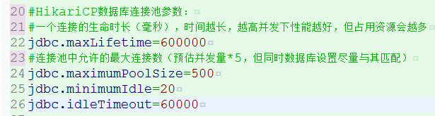

|作者|日期|
|----|---|
|吴云龙|2019年4月30日|
|邝慧兰|2019年6月18日|

-------------------------------

#### 2019年6月18日

###### 注意事项如下：

前段时间在项目现场碰到过一个连接池，因连接数配置不对导致连接不上的问题。如果项目war包使用了
com.zaxxer.hikari.HikariDataSource 连接池
相应配置要做调整

设置这四个参数，且值建议如下：

-------------------------------

#### 2019年4月30日发布版本 2.5.1
#### 修复bug如下：

#### 增加新功能如下：

###### 注意事项如下：

* 当前版本修改了部分配置文件，部署可能会出现错误提示myconfig.properties找不到文件的提示。 [点击查看解决办法](ibase/部署相关/配置文件.md)

-------------------------------

