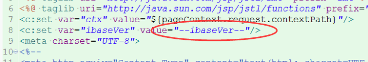

 <center><h2>ibase2.0使用变量ibaseVer来控制缓存</h2></center>

#### 实现逻辑：
1. 在批处理发布编译时自动以当前时间生成版本号，格式：YYMMDDHHmm（共10位）
2.在发布编译时替换对应的标记，所以在其他情况下，不要手动改global.jsp中的这个内容（因为编译根据这个找并替换的）
3. 版本号定义在common/global.jsp中



#### 实现范围：
（目前只有四个服务：主框架、公共应用、工作流、表单）
- [x] mainWeb
- [x] pubWeb
- [x] workflowWebService
- [x] formEngineWebService

#### 变量名为：`ibaseVer`
* 可在jstl中使用
* 可在js中使用

?> 在任意位置，变量名均保持一致
###### jsp按如下方式使用：
```html
<script type="text/javascript" src="/public/js/ibasesys.min.js?v=${ibaseVer}"></script>
```

```jstl用法
<!doctype html>
<html>
<body>
	
</body>
</html>
```

###### JS中按照如下方式使用：(此处使用es6语法作为示范)
```javascript
// var ibaseVer = 版本号  (默认会在js中注入)
document.write(`<script type="text/javascript" src="//domain.com/js.js?ibaseVer=${ibaseVer}"></script>`)
```

 

