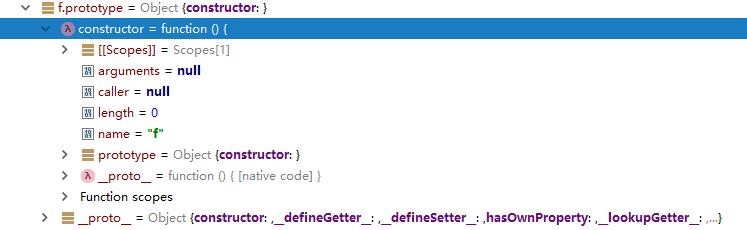
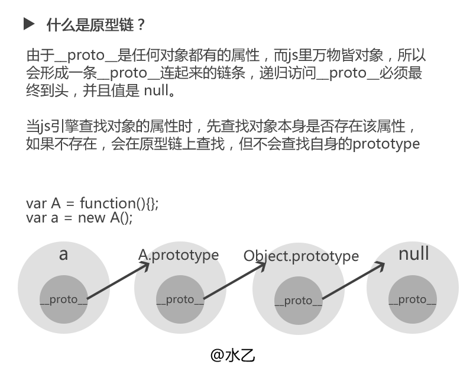

> JavaScript 常被描述为一种基于原型的语言 (prototype-based language)——每个对象拥有一个原型对象，对象以其原型为模板、从原型继承方法和属性。
原型对象也可能拥有原型，并从中继承方法和属性，一层一层、以此类推。这种关系常被称为原型链 (prototype chain)，
它解释了为何一个对象会拥有定义在其他对象中的属性和方法

## JavaScript原型与原型链

### JavaScript原型
> 警告： JavaScript中 原型 !== prototype 原型并非全部都是prototype 

JavaScript在设计的时候,就考虑到了对象的继承相关属性，设计出了原型来创建所有的对象。所谓的万物皆对象，在JavaScript中无论是null,undefined，
function全部都是对象的一种。

### 函数的属性prototype

前面讲到，JavaScript中万物皆对象，对于函数，自然也是对象的一种。 所以函数拥有`属性`应该也不会觉得不可思议吧！

对于第一语言是静态语言的童鞋们来说，一时间接受 方法拥有属性是一个难以矫正的过程，但是动态语言就是这么灵活，灵活也是一种特点。 随后会讲java原型模式

```javascript
var f = function() {
	console.log('function')
}
console.log(f.prototype)      // -> {}
f.prototype.constructor == f  // -> true
```

在JavaScript中，方法/函数是拥有默认的一个属性的，属性名称叫做prototype,prototype属性本身是一个对象。


