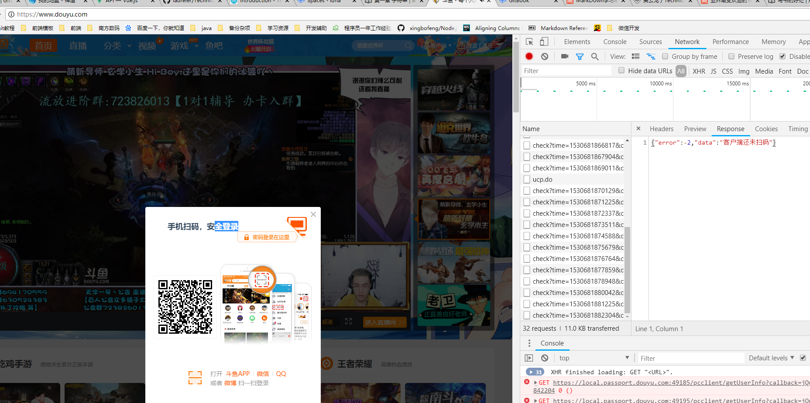
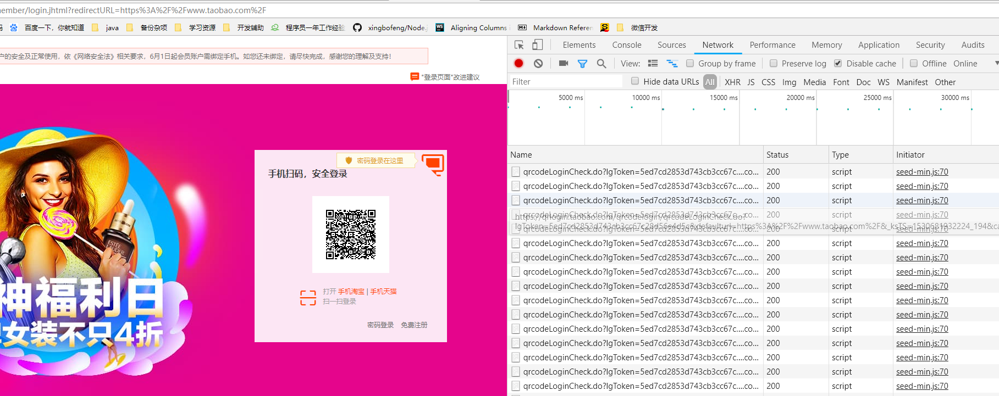

轮询使用的场景：
1. 浏览器在二维码扫码登陆的时候，通过不断的访问服务器的响应来判断用户在扫码之后是否已经成功。




```ecmascript 6
// 使用： 设置一个 6s时间长度的轮询，成功之后来到定义的回调事件
let number = initcheck(null,6000,function(data){
	var lastNumber = new Date().getTime().toString().substr(new Date().getTime().toString().length-1,1)
	console.log(lastNumber)
})

// 使用： 根据轮询返回的number 作为参数来关闭当前的轮询
// initcheck(number)

/**
 * @requires
 * 开启轮询操作
 * @return intervalNumber   当前轮询实例的ID值 通过ID值来关闭轮询
 * @param time              轮询失效时间(秒)
 * @param callback          轮询每秒钟处理的句柄函数
 */
function initcheck (intervalNumber,time,callback) {
	var startTime = new Date().getTime();
	// 轮询的id若非空的话 就关闭轮询并且退出
	if(intervalNumber !== undefined && intervalNumber !== null){
		clearInterval(intervalNumber)
		return
	}
	// 若时间没有定义 就要求设定时间
	if(time !== undefined && intervalNumber !== null) {
		console.error('请设置轮询时间!')
		return
	}
	// 轮询实例返回的标识
	var number =  setInterval(function(){
		if(new Date().getTime() -startTime > time) clearInterval(number)
		callback(this)
	}, 1000);
	return number
}
```