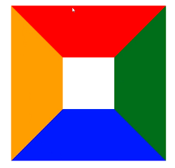
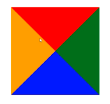
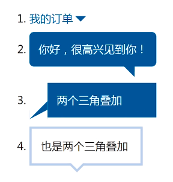

## dotted IE7/8圆角
## double 三道杠图标
## 三角和体型

```css
.box {
	border-width: 12px 20px;
	border-style: solid;
	border-color: red red transparent transparent;
}
```
原理是利用了
```css
.box {
	width: 100px;
	height: 100px;
	border:100px solid;
	border-color: red green blue orange;
}
```



当我们设置了一个div并且设置了巨大无比的border之后，就会出现相邻的边缘出现了规则的45°角。

如果设置了高宽为0 就可以出现三角形



#### 使用场景



## 单选框、复选框效果(css)

## 增加可视渲染区域
```css
.icon {
filter:drop-shadow(20px 0 #27a3e1);
}
```