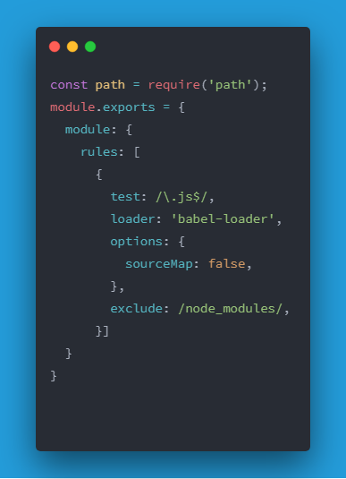
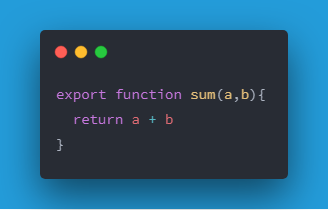
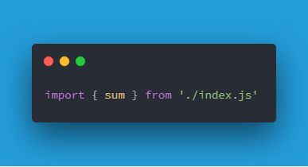

<center><h2>理解 CommonJS AMD CMD 三种规范</h2></center>

前言：
	JavaScript设计之初，是没有预料到现在的蓬勃发展的。没有模块化的这一个缺点也一直没有得到解决。
	JavaScript如果没有模块化，庞大的代码也就难以阻止与管理。模块化的管理也更有利于多人之间的合作。

#### 举例说明：

> 没有模块化下的代码开发：

```javascript
var user = '小明'
var vip_user = 'vip小明'
var super_user = 'supervip小明'
// ........
// 如果后续我们还有其他页面系统，也存在着自己的会员管理
var user = '后台管理员'
// var super_user = '超级管理员' //error 注意，此时已经出现了重复的命名
```
伴随着项目发展越来越大，出现重名的可能性也逐渐增多，归根结底原因是因为大家没有模块化的概念、

三种主流的模块化概念：
1. CommonJS
2. ES6 Module
2. AMD
3. CMD
## CommonJS

> CommonJS使用的代表 node.js

> 由于webpack是基于node.js运行的JavaScript库，所以我们常常在配置webpack的时候使用到 `require` 以及相关的`module.exports`



CommonJS模块的规范有三个
1. 模块定义(module/exports)
2. 模块引用(require)
3. 模块标识

在CommonJS中，模块只有唯一的出口，就是 `module.exports`对象，我们要把所有要导出的变量或者函数都放在这个对象中，然后导出这个对象。

```javascript
function isNumber(n) {
  return typeof n === 'number'
}

module.exports = {
	sum:function(a,b) {
	  if (isNumber(a) && isNumber(b)){
	  	return a+b
	  } else {
	  	return NaN
	  }
	}
}
// 你也可以写 和上方完全等价
exports.sum = function(a,b) {
  //.......
}
```
上述代码中我们导出了只有一个匿名对象，对象中包含了一个方法 sum

!> 绝对不可以 `exports = {}` 的方式导出，
  因为exports是最后模块导出的部分,使用了 `exports = {}`就是重新赋值，那么`exports`与`module.exports`就会变成两个完全不同的对象，你随后所有的操作都会失效！
  
?> 注意 exports.sum 只是在exports上面继续追加属性，而非覆盖exports

在其他模块中，我们就可以使用
```javascript
var someObject = require('./index')
someObject.sum(2,'2')     // ----> NaN
someObject.sum(2,2)         // ------> 4
someObject,isNumber()      // ------>error
```
模块的引用：
1. `require('http')`
2. `require('./index.js')`  //注意 *.js 可以省略，但是为了避免混淆，建议不要省略。

## ES6 Module
可以直截了当的说，前端工程师，ES6已经是你们最终的归宿了，如果你不学习node.js的话。
##### ES6 VS CommonJS区别
1. CommonJS运行时加载，也就是说执行一个模块，该模块返回一个对象，
2. ES6module却是语言层面的，导入导出是声明式的代码。    `import {a.b} from './moduleName`

##### 导出集合： es6可以导出不同的对象做为模块
```javascript
	export const ipAddress = '127.0.0.1'
	export let port = 8080
```
ES6中有一个很大的缺陷，在于我必须要知道导出了什么样子的module，才能够导入。

  

但是你可以利用 
```javascript
import * as sum from './index.js'
```
或者利用
```javascript
export default function() {
  //........
}
var sum2 = function() {
  
}

export{
	sum2 as default
}
```

##### 聚合模块


## AMD

AMD 
AMD最早是在RequireJS在推广的过程中，对模块定义的规范化。

他允许异步加载，允许指定回调函数。

AMD标准中，定义了两个API
1. require([module],callback)
2. define(id,[depends],callback)

其中`define`用来定义一个模块，然后使用`require`来加载一个模块，并且`require`还支持了CommonJS模块导出方式。
## CMD
CMD
CMD最早是SeaJS在推广过程中对模块定义的规范化产出，CMD是同步模块定义。
```javascript
define(function (require, exports, module) {
	// 使用 require 方法来引入依赖
	var $ = require('jquery')             //引入jquery
	var Spinning = require('./spinning')  //引入相邻文件模块
	exports.doSometing = function () {
		// do something
	}
	module.exports = function () {
		// do something
	}
})
```

