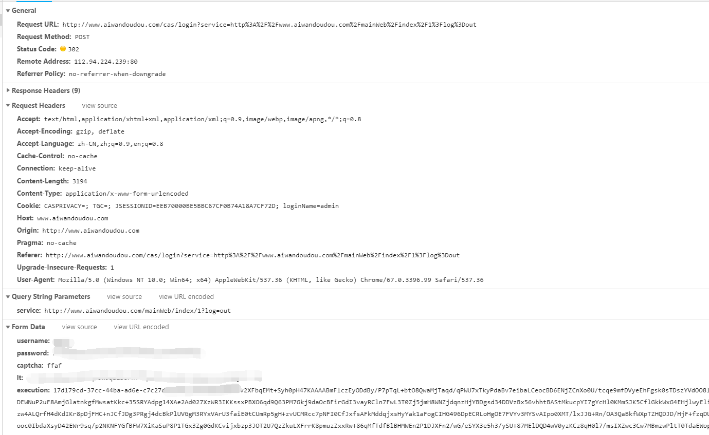

**restful 是一种架构风格、设计风格。而并非标准。**

> RESTful原本名称叫做  representational state transfer  (代表性 声明 传递协议) 我理解为：`代表性的传输协议`

> 在其他领域还有一个词 叫做 representational difference analysis （代表性差异分析法）

--------------------

## 什么是restful？

restful是一种设计风格，就好像你用tab别人用四个空格一样，你喜欢就是你自己的风格。
```javascript
	var s = 'tab'
    var space = '四个空格' //用你喜欢的风格就好
```
但是，restful之所以能够流行起来一定是有一定的`优点`或者说被大家所认同的地方。

## restful的优点
 todo 待补充

## 什么是幂等？
幂等最早出自于数学：

其中的`幂`就是指 乘方运算的结果，例如 a^n a的n次方，a为幂的底数，n为幂的指数。<br/>
幂等元素就是自己被重复运算，结果等于他自己的元素。乘法中唯二幂等的实数为 0和1。 幂等函数可以在相同的参数下重复执行，并且获取到相同结果的函数。

说完数学，幂等这个概念在计算机里面也有大量用到:

一个幂等操作就是 一次或者多次执行 影响均相同，举个栗子：
```javascript
	function f(param) {
	  console.log('hello ' + param)
	}
	f('world')
	f('world')
	f('world')
	// ………… 无论执行多少次，出现的结果都是 hello world
```
这就是幂等性，幂等性为何如此重要，因为我们在编程中大量的有利用到这个特性：<br/>
**最常见的一个例子**<br/>
你可能会遇到这种问题，你写了一个方法，传递了一个参数做测试，然后偶然情况下会出现错误，但是大部分情况下不会出现。你不得不为了和这个幽灵一样的存在而找bug到头大。
此时你最希望的结果就是 这个方法每次都会正确，和你测试的时候一样（这就是幂等性）。<br/>
**接口也一样**<br/>
我们在前后端对接的时候，最头大的无非就是接口报错，有时候正确有时候不正确，是不是像极了上面所说的情况？但是对于灵活的业务逻辑，有的时候不得已而为之，
必须报错。所以我们在rest风格里面严格规定了符合幂等性和不符合幂等性的不同方法。

## restful 的示例
>下面列出了GET，DELETE，PUT和POST的典型用法:

| 请求方式 | 是否幂等  | 是否安全 |  作用 | 示例|
| :------------: |:---------------:| :-----:| :-----:| :-----:|
|GET|幂等|安全|获取表示|获取一个人的手机号码|
|POST|不幂等|不安全|使用服务端的实例创建资源|添加一个人的手机号码|
|PUT|幂等|不安全|通过替换的方式来更新资源|修改一个人的手机号码|
|DELETE|幂等|不安全|使用服务端的实例创建资源|删除一个人的手机号码|

## 参数如何传递？
以前我们只用过GET和POST请求 参数无非就是GET请求地址后面添加?然后紧跟参数。如下：
```http request
https://www.baidu.com/s?wd=java&rsv_spt=1&rsv_iqid=0xa9828fb600006fec&issp=1&f=8&rsv_bp=0&rsv_idx=2&ie=utf-8&tn=baiduhome_pg&rsv_enter=1&rsv_sug3=4&rsv_sug1=3&rsv_sug7=100&rsv_sug2=0&inputT=531&rsv_sug4=531
https://www.baidu.com/s?wd=java
``` 
百度搜索java用的也是get请求（安全且幂等）
下面的是post请求，它不仅仅跟了参数，而且还添加了form表单数据一并提交。


a查看具体的请求参数](./HTTP请求.md)
