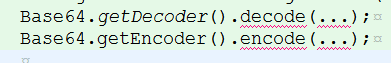
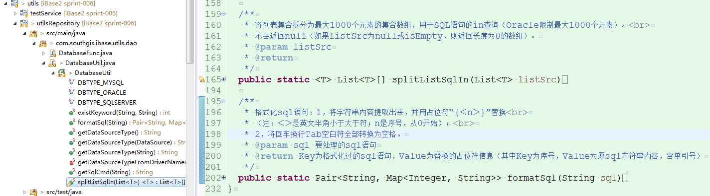
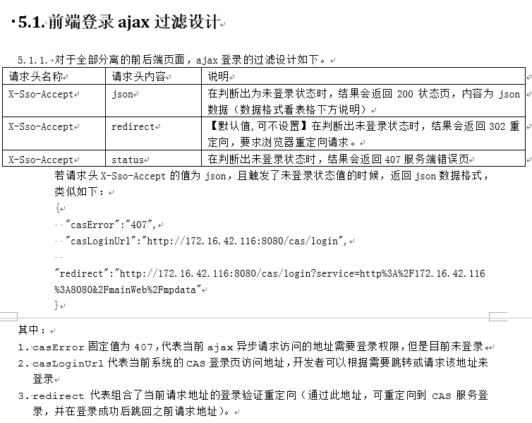
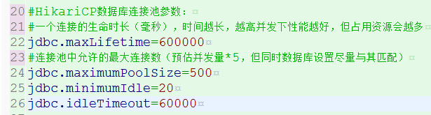

|作者|日期|
|----|---|
|吴云龙|2019年4月30日|
|邝慧兰|2019年6月18日|
|邝慧兰|2019年7月17日|

-------------------------------

#### 2019年7月17日
**1.** Base64编码解码器，使用jdk自带的。不要引其他第三方包了：

**2.** 为了实现sql语句的分析，实现了formatSql;
为了实现in查询元素超过长度限制，实现了splitListSqlIn

**3.** 为了统一，将cas-client的返回行为做了调整。版本号升级到了3.5.0.5

在parent/pom.xml中调整cas-client-core版本号。（已在spring-006上提交了）
#### 2019年6月18日

###### 注意事项如下：

前段时间在项目现场碰到过一个连接池，因连接数配置不对导致连接不上的问题。如果项目war包使用了
com.zaxxer.hikari.HikariDataSource 连接池
相应配置要做调整

设置这四个参数，且值建议如下：

-------------------------------

#### 2019年4月30日发布版本 2.5.1
#### 修复bug如下：

#### 增加新功能如下：

###### 注意事项如下：

* 当前版本修改了部分配置文件，部署可能会出现错误提示myconfig.properties找不到文件的提示。 [点击查看解决办法](ibase/部署相关/配置文件.md)

-------------------------------

